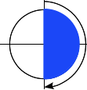
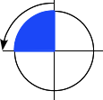
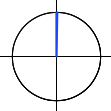

## 目标

- 了解掌握CSS值和单位
- 了解掌握CSS文字排版
- 了解掌握CSS变换，过渡，动画
- 了解掌握CSS定位

### CSS的值和单位

[https://developer.mozilla.org/zh-CN/docs/Learn/CSS/Building_blocks/Values_and_units](https://developer.mozilla.org/zh-CN/docs/Learn/CSS/Building_blocks/Values_and_units)

这里列举几种常用的单位

- **px**，像素，绝对单位

- **em**，在 `font-size` 中使用是相对于父元素的字体大小，在其他属性中使用是相对于自身的字体大小，如 `width`

- **rem**，`html` 根元素的字体大小

- **百分比**，在许多情况下，百分比与长度的处理方法是一样的。百分比的问题在于，它们总是相对于其他值设置的。例如，如果将元素的字体大小设置为百分比，那么它将是元素父元素字体大小的百分比。如果使用百分比作为宽度值，那么它将是父值宽度的百分比。

- **数字**，有些值接受数字，不添加任何单位。接受无单位数字的属性的一个例子是不透明度属性（`opacity` ），它控制元素的不透明度(它的透明程度)。此属性接受0(完全透明)和1(完全不透明)之间的数字。

- **颜色**，在CSS中指定颜色的方法有很多，其中一些是最近才实现的。在CSS中，相同的颜色值可以在任何地方使用，无论您指定的是文本颜色、背景颜色还是其他颜色。
  
  现代计算机的标准颜色系统是24位的，它允许通过不同的红、绿、蓝通道的组合显示大约1670万种不同的颜色，每个通道有256个不同的值(256 x 256 x 256 = 16,777,216)。让我们来看看在CSS中指定颜色的一些方法。
  
  - 颜色关键词，这是一种指定颜色的简单易懂的方式，具体关键词列表可以查阅 [\<color\>](https://developer.mozilla.org/en-US/docs/Web/CSS/color_value)
    
    ```css
    p {
      color: red;
    }
    ```
  
  - 十六进制RGB值，你可能遇到的下一种颜色值类型是十六进制代码。每个十六进制值由一个(#)和六个十六进制数字组成，每个十六进制数字都可以取0到f(代表15)之间的16个值中的一个——所以是0123456789abcdef。每对值表示一个通道—红色、绿色和蓝色—并允许我们为每个通道指定256个可用值中的任意一个(16 x 16 = 256)。
    
    ```css
    p {
      color: #ff0000;
    }
    ```
  
  - RGB 和 RGBA的值，我们将在这里讨论的第三种方案是RGB。RGB值是一个函数—RGB()—它有三个参数，表示颜色的红色、绿色和蓝色通道值，与十六进制值的方法非常相似。RGB的不同之处在于，每个通道不是由两个十六进制数字表示的，而是由一个介于0到255之间的十进制数字表示的——这有点容易理解。
    
    ```css
    p {
      color: rgb(255, 0, 0);
    }
    ```
    
    你还可以使用RGBA颜色——它们的工作方式与RGB颜色完全相同，因此您可以使用任何RGB值，但是有第四个值表示颜色的alpha通道，它控制不透明度。如果将这个值设置为0，它将使颜色完全透明，而设置为1将使颜色完全不透明。介于两者之间的值提供了不同级别的透明度。
    
    ```css
    p {
      color: rgba(255, 0, 0, 0.5);
    }
    ```

- 位置，`position` 数据类型表示一组2D坐标，用于定位一个元素，如背景图像(通过 `background-position`)。它可以使用关键字(如 `top`, `left`, `bottom`, `right`, 以及 `center` )将元素与2D框的特定边界对齐，以及表示框的顶部和左侧边缘偏移量的长度。示例
  
  ```css
  p {
    background-position: center;
  }
  ```

### 文字排版

元素中的文本是布置在元素的内容框中。以内容区域的左上角作为起点 (或者是右上角，是在[ RTL ](https://developer.mozilla.org/zh-CN/docs/Learn/CSS/Building_blocks/Handling_different_text_directions)语言的情况下)，一直延续到行的结束部分。一旦达到行的尽头，它就会进到下一行，然后继续，再接着下一行，直到所有内容都放入了盒子中。文本内容表现地像一些内联元素，被布置到相邻的行上，除非到达了行的尽头，否则不会换行，或者你想强制地，手动地造成换行的话，你可以使用 `<br>` 元素。

```css
  direction: rtl;
```

#### 颜色

`color` 属性设置选中元素的前景内容的颜色 (通常指文本，不过也包含一些其他东西，比如使用 `text-decoration` 属性设置的下划线。

#### 字体种类

要在你的文本上设置一个不同的字体，你可以使用 font-family  属性，这个允许你为浏览器指定一个字体 (或者一个字体的列表)，然后浏览器可以将这种字体应用到选中的元素上。浏览器只会把在当前机器上可用的字体应用到当前正在访问的网站上；如果字体不可用，那么就会用浏览器默认的字体代替 default font. 下面是一个简单的例子：

```css
p {
  font-family: arial;
}
```

这段语句使所有在页面上的段落都采用 `arial` 字体，这个字体可在任何电脑上找到。

由于你无法保证你想在你的网页上使用的字体的可用性 (甚至一个网络字体可能由于某些原因而出错), 你可以提供一个字体栈 (font stack)，这样的话，浏览器就有多种字体可以选择了。只需包含一个font-family属性，其值由几个用逗号分离的字体名称组成。比如

```css
p {
  font-family: "Trebuchet MS", Verdana, sans-serif;
}
```

在这种情况下，浏览器从列表的第一个开始，然后查看在当前机器中，这个字体是否可用。如果可用，就把这个字体应用到选中的元素中。如果不可用，它就移到列表中的下一个字体，然后再检查。

#### 字体大小

我们可以通过 `font-size` 属性设置字体大小，最常用的单位是

- **px**：像素，这是一个绝对单位，它导致了在任何情况下，页面上的文本所计算出来的像素值都是一样的。
- **em**：1em 等于我们设计的当前元素的父元素上设置的字体大小
- **rem**：这个单位的效果和 em 差不多，除了 1rem 等于 HTML 中的根元素的字体大小，而不是父元素。这可以让你更容易计算字体大小

元素的 `font-size` 属性是从该元素的父元素继承的。所以这一切都是从整个文档的根元素 — `<html>`开始，浏览器的 font-size 标准设置的值为 16px。

一个使用 `rem` 单位的示例，在移动端适配的时候会变得很有用

```css
html {
  font-size: 10px;
}

h1 {
  font-size: 2.6rem;
}

p {
  font-size: 1.4rem;
  color: red;
  font-family: Helvetica, Arial, sans-serif;
}
```

#### 文字样式

- **font-style**：用来打开和关闭文本 italic (斜体)，一般只会用到下面的值
  
  - `italic`：如果当前字体的斜体版本可用，那么文本设置为斜体版本。

- **font-weight**：置文字的粗体大小
  
  - `normal`：普通
  - `bold`：加粗

- **text-decoration**：设置/取消字体上的文本装饰
  
  - `none`：取消已经存在的任何文本装饰
  - `underline`：文本下划线
  - `overline`：本上划线
  - `line-through`：穿过文本的线

- **text-align**：用来控制文本如何和它所在的内容盒子对齐。可用值如下，并且在与常规文字处理器应用程序中的工作方式几乎相同：
  
  - `left`：左对齐文本
  - `right`：右对齐文本
  - `center`：居中文字

- **line-height**：设置文本每行之间的高，可以接受大多数单位，不过也可以设置一个无单位的值，作为乘数，通常这种是比较好的做法。无单位的值乘以 `font-size` 来获得 `line-height`。当行与行之间拉开空间，正文文本通常看起来更好更容易阅读。推荐的行高大约是 1.5–2 (双倍间距) 所以要把我们的文本行高设置为字体高度的1.5倍，你可以使用这个:
  
  ```css
  p {
    line-height: 1.5;
  }
  ```

### CSS变换

[https://developer.mozilla.org/zh-CN/docs/Web/CSS/transform](https://developer.mozilla.org/zh-CN/docs/Web/CSS/transform)

CSS `transform` 属性允许你旋转，缩放，倾斜或平移给定元素。这是通过修改CSS视觉格式化模型的坐标空间来实现的，比较常用的有以下几个

- translate：移动
- scale：缩放
- rotate：旋转

> 示例

```CSS
transform: translate(12px, 50%);
transform: scale(2, 0.5);
transform: rotate(10deg);
```

#### angle 角度

`angle` 用于表示角的大小，常用单位有度（`degrees`）、圈数（`turns`）。在 `gradient` 和 `transform` 的某些方法等场景中有所应用。

- `deg`：度，一个完整圆是 `360deg`，例如：`0deg`，`90deg`
- `turn`：圈数，一个完整的圆是 `1turn`,例如：`0turn`，`0.25turn`，`1.2turn`

| 示意图                        | 度数                         |
| -------------------------- | -------------------------- |
|       | 直角：90deg = 0.25turn        |
|      | 平角：180deg = 0.5turn        |
|  | 直角（逆时针）：-90deg = -0.25turn |
|        | 零角：0 = 0deg = 0turn        |

> 练习

自己练习相关知识点

### CSS过渡

[https://developer.mozilla.org/zh-CN/docs/Web/CSS/CSS_Transitions/Using_CSS_transitions](https://developer.mozilla.org/zh-CN/docs/Web/CSS/CSS_Transitions/Using_CSS_transitions)


CSS `transition` 提供了一种在更改CSS属性时控制动画速度的方法。其可以让属性变化成为一个持续一段时间的过程，而不是立即生效的。比如，将一个元素的颜色从白色改为黑色，通常这个改变是立即生效的，使用 CSS `transition` 后该元素的颜色将逐渐从白色变为黑色，按照一定的曲线速率变化，这样可以让状态的切换变得更平滑，而不是那么生硬。

通常将两个状态之间的过渡称为 `隐式过渡（implicit transitions）`，因为开始与结束之间的状态由浏览器决定。

- transition-property：应用过渡效果的属性
- transition-duration：过渡时间
- transition-timing-function：过渡函数
- transition-delay：等待时间

也可以简写，如

```CSS
.trans {
  transition: all 0.5s ease-out;
}
```

> 练习

自己练习相关知识点

### CSS动画

[https://developer.mozilla.org/zh-CN/docs/Web/CSS/CSS_Animations/Using_CSS_animations](https://developer.mozilla.org/zh-CN/docs/Web/CSS/CSS_Animations/Using_CSS_animations)

CSS `animation` 使得可以将从一个CSS样式配置转换到另一个CSS样式配置。动画包括两个部分：描述动画的样式规则和用于指定动画开始、结束以及中间点样式的关键帧。示例如下

```css
p {
  /* 持续时间 | 动画名称 */
  animation: 3s slidein;
}
```

#### 使用keyframes定义动画序列

一旦完成动画的时间设置， 接下来就需要定义动画的表现。通过使用 `@keyframes` 建立两个或两个以上关键帧来实现。每一个关键帧都描述了动画元素在给定的时间点上应该如何渲染。

因为动画的时间设置是通过CSS样式定义的，关键帧使用 `percentage` 来指定动画发生的时间点。`0%` 表示动画的第一时刻，`100%` 表示动画的最终时刻。因为这两个时间点十分重要，所以还有特殊的别名：`from` 和 `to`。这两个都是可选的，若 `from/0%` 或 `to/100%` 未指定，则浏览器使用计算值开始或结束动画。

也可包含额外可选的关键帧，描述动画开始和结束之间的状态，示例如下

```css
p {
  animation: 3s slidein;
}

@keyframes slidein {
  from {
    margin-left: 100%;
    width: 300%;
  }

  to {
    margin-left: 0%;
    width: 100%;
  }
}
```

#### 重复动画

`animation-iteration-count` 用以指定动画重复的次数，仅仅使用该属性就能使动画重复播放。在该例中，设该属性为 `infinite` 以使动画无限重复

```css
p {
  animation-duration: 3s;
  animation-name: slidein;
  animation-iteration-count: infinite;
}
```

### 定位

#### 文档流

定位是一个相当复杂的话题，默认情况下，块级元素的内容宽度是其父元素的宽度的100％，并且与其内容一样高。内联元素高宽与他们的内容高宽一样。您不能对内联元素设置宽度或高度——它们只是位于块级元素的内容中。

正常的布局流是将元素放置在浏览器视口内的系统。默认情况下，块级元素在视口中垂直布局——每个都将显示在上一个元素下面的新行上，并且它们的外边距将分隔开它们。

内联元素表现不一样——它们不会出现在新行上；相反，它们互相之间以及任何相邻（或被包裹）的文本内容位于同一行上，只要在父块级元素的宽度内有空间可以这样做。如果没有空间，那么溢流的文本或元素将向下移动到新行。

如果两个相邻元素都在其上设置外边距，并且两个外边距接触，则两个外边距中的较大者保留，较小的一个消失——这叫外边距折叠。

#### 介绍定位

定位的整个想法是允许我们覆盖上面描述的基本文档流行为，以产生有趣的效果。如果你想稍微改变布局中一些盒子的位置，定位是你的工具。或者，如果您想要创建一个浮动在页面其他部分顶部的UI元素，并且或者始终停留在浏览器窗口内的相同位置，无论页面滚动多少？定位使这种布局工作成为可能。

有许多不同类型的定位，要使某个元素上的特定类型的定位，我们使用 `position` 属性。

#### 静态定位

静态定位是每个元素获取的默认值——它只是意味着“将元素放入它在文档布局流中的正常位置 ——这里没有什么特别的。

#### 相对定位

相对定位是我们将要看的第一个位置类型。它与静态定位非常相似，占据在正常的文档流中，除了你仍然可以修改它的最终位置，包括让它与页面上的其他元素重叠。让我们继续并更新代码中的 `position` 属性：

```css
.positioned {
  position: relative;
}
```

`top`, `bottom`, `left`, 和 `right` 来精确指定要将定位元素移动到的位置

```css
.positioned {
  position: relative;
  top: 30px;
  left: 30px;
}
```

相对定位工作的方式——你需要考虑一个看不见的力，推动定位的盒子的一侧，移动它的相反方向。所以，如果你指定 `top: 30px;` 一个力推动框的顶部，使它向下移动30px。

#### 绝对定位

绝对定位带来了非常不同的结果。让我们尝试改变代码中的位置声明如下：

```css
.positioned {
  position: absolute;
  top: 30px;
  left: 30px;
}
```

首先，请注意，定位的元素应该在文档流中的间隙不再存在——第一和第三元素已经靠在一起，就像第二个元素不再存在！在某种程度上，这是真的。绝对定位的元素不再存在于正常文档布局流中。相反，它坐在它自己的层独立于一切。这是非常有用的：这意味着我们可以创建不干扰页面上其他元素的位置的隔离的UI功能。例如，弹出信息框和控制菜单；翻转面板；可以在页面上的任何地方拖放的UI功能……

第二，注意元素的位置已经改变——这是因为 `top`，`bottom`，`left` 和 `right` 以不同的方式在绝对定位。它们指定元素应距离每个包含元素的边的距离，而不是指定元素应该移入的方向。所以在这种情况下，我们说的绝对定位元素应该位于从“包含元素”的顶部30px，从左边30px。

#### 定位上下文

哪个元素是绝对定位元素的“包含元素“？这取决于绝对定位元素的父元素的 `position` 属性。

如果所有的父元素都没有显式地定义position属性，那么所有的父元素默认情况下 `position` 属性都是 `static`。结果，绝对定位元素会被包含在初始块容器中。这个初始块容器有着和浏览器视口一样的尺寸，并且 `<html>` 元素也被包含在这个容器里面。简单来说，绝对定位元素会被放在 `<html>` 元素的外面，并且根据浏览器视口来定位。

我们可以改变定位上下文 —— 绝对定位的元素的相对位置元素。通过设置其中一个父元素的定位属性为相对定位。

#### 介绍z-index

还有另一件事我们还没有考虑到 — 当元素开始重叠，什么决定哪些元素出现在其他元素的顶部？在我们已经看到的示例中，我们在定位上下文中只有一个定位的元素，它出现在顶部，因为定位的元素胜过未定位的元素。当我们有不止一个的时候呢？我们可以使用 `z-index` 属性来更改堆叠顺序，它代表z轴的参考，`z-index` 只接受无单位索引值,较高的值将高于较低的值，示例如下：

```css
.positioned {
  position: absolute;
  top: 30px;
  left: 30px;
  z-index: 100;
}
```

#### 固定定位

还有一种类型的定位覆盖 — `fixed`。这与绝对定位的工作方式完全相同，只有一个主要区别：绝对定位固定元素是相对于 `<html>` 元素或其最近的定位祖先，而固定定位固定元素则是相对于浏览器视口本身。这意味着您可以创建固定的有用的UI项目，如持久导航菜单，示例：

```css
h1 {
  position: fixed;
  top: 0;
  width: 500px;
  background: white;
  padding: 10px;
}
```

#### 粘粘定位

```css
.positioned {
  position: sticky;
  top: 0;
  left: 0;
}
```

> 注意几点问题
> 
> - 需要设定`top`,`left`,`right`,`bottom`的值
> - 任意一个父元素不能设置`overflow: hidden`属性
> - 直接父组件的高度不能和设置该定位的元素相等，因为粘粘是相对父组件的位置进行粘粘

<font color="red">**注意：定位技术通常只用来做一些局部的特殊效果，例如层叠菜单、弹出层等等，不要用来做整体的布局！**</font>

> 练习

自己练习相关知识点

## 课后练习

使用HTML + CSS实现个人简历，内容以及样式自定。

- 内容真实，样式美观
- 禁止使用框架以及样式库
- 代码放在 `work-03` 目录下
- 代码在下周一中午12点之前推送至Git服务的个人作业仓库
