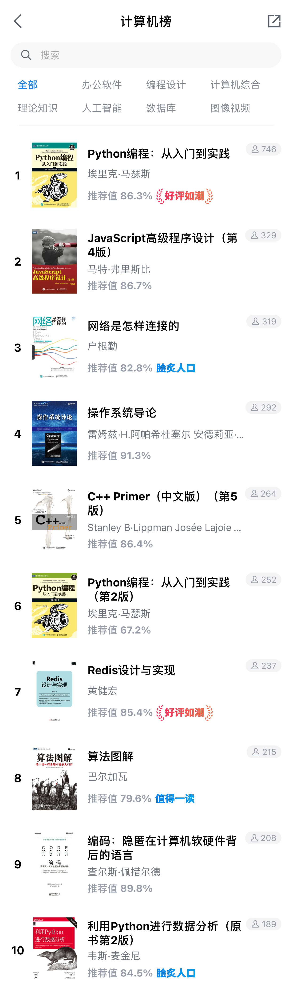

# CSS进阶-Flex布局

## 目标

- 掌握Flex布局

网页布局（layout）是 CSS 的一个重点应用。布局的传统解决方案，基于盒状模型，依赖 display 属性 + position属性 + float属性。它对于那些特殊布局非常不方便，比如，垂直居中就不容易实现。

2009年，W3C 提出了一种新的方案----Flex 布局，可以简便、完整、响应式地实现各种页面布局。目前，它已经得到了所有浏览器的支持，这意味着，现在就能很安全地使用这项功能。

## Flex布局

[https://developer.mozilla.org/zh-CN/docs/Learn/CSS/CSS_layout/Flexbox](https://developer.mozilla.org/zh-CN/docs/Learn/CSS/CSS_layout/Flexbox)

Flex 是 Flexible Box 的缩写，意为"弹性布局"，用来为盒状模型提供最大的灵活性。任何一个容器都可以使用flex布局。

```css
.container {
  display: flex;
}
```

弹性盒子是一种用于按行或按列布局元素的一维布局方法。元素可以膨胀以填充额外的空间, 收缩以适应更小的空间，Flex布局非常灵活和方便，是目前使用最广泛的布局技术。

当元素表现为 flex 框时，它们沿着两个轴来布局：


- `主轴（main axis）` 是沿着 flex 元素放置的方向延伸的轴（比如页面上的横向的行、纵向的列）。该轴的开始和结束被称为 main start 和 main end。
- `交叉轴（cross axis）` 是垂直于 flex 元素放置方向的轴。该轴的开始和结束被称为 `cross start` 和 `cross end`。
- 设置了 `display: flex` 的父元素被称之为 flex 容器（`flex container`）。
- 在 `flex` 容器中表现为柔性的盒子的元素被称之为 `flex项`（`flex item`）

### 排列方向

弹性盒子提供了 `flex-direction` 这样一个属性，它可以指定主轴的方向（弹性盒子子类放置的地方）— 它默认值是 `row`，这使得它们在按你浏览器的默认语言方向排成一排（在英语/中文浏览器中是从左到右），如果更改为如下设置：

```css
.box {
  flex-direction: column;
}
```

你会看到，这会将那些元素设置为列布局。

### 换行

当你在布局中使用定宽或者定高的时候，可能会出现问题即处于容器中的 弹性盒子子元素会溢出，破坏了布局，解决此问题的一种方法是将以下声明添加到 `css` 规则中：

```css
.box {
  flex-wrap: wrap;
}

.item {
  flex: 200px;
}
```

### flex 项的动态尺寸

`flex` 属性是一个无单位的比例值，表示每个 `flex` 项沿主轴的可用空间大小。本例中，我们设置 `<article>` 元素的 flex 值为 1，这表示每个元素占用空间都是相等的，占用的空间是在设置 `padding` 和 `margin` 之后剩余的空间。因为它是一个比例，这意味着将每个 flex 项的设置为 `400000` 的效果和 `1` 的时候是完全一样的。

```css
article {
  flex: 1;
}
```

### 水平和垂直对齐

`align-items` 控制 flex 项在交叉轴上的位置。

- 默认的值是 `stretch`，其会使所有 `flex` 项沿着交叉轴的方向拉伸以填充父容器。如果父容器在交叉轴方向上没有固定宽度（即高度），则所有 `flex` 项将变得与最长的 `flex` 项一样长（即高度保持一致）。
- `center` 值会使这些项保持其原有的高度，但是会在交叉轴居中。
- 你也可以设置诸如 `flex-start` 或 `flex-end` 这样使 `flex` 项在交叉轴的开始或结束处对齐所有的值。

`justify-content` 控制 `flex` 项在主轴上的位置。

- 默认值是 `flex-start`，这会使所有 `flex` 项都位于主轴的开始处。
- 你也可以用 `flex-end` 来让 flex 项到结尾处。
- `center` 在 `justify-content` 里也是可用的，可以让 `flex` 项在主轴居中。
- `space-around` 是很有用的——它会使所有 `flex` 项沿着主轴均匀地分布，在任意一端都会留有一点空间。
- 还有一个值是 `space-between`，它和 `space-around` 非常相似，只是它不会在两端留下任何空间。

### 课堂练习

> 使用flex实现一个三明治布局

三明治布局页面在垂直方向上，分成三部分：页眉、内容区、页脚。

## 课后任务

目标页面为 `微信读书列表页`。


- 页面数据在`task/task-flex/books.json`
- 相关图标在 `imgs` 目录已有提供
- 代码放在 `work-04` 目录下
- 代码在下周一中午12点之前推送至Git服务的个人作业仓库
