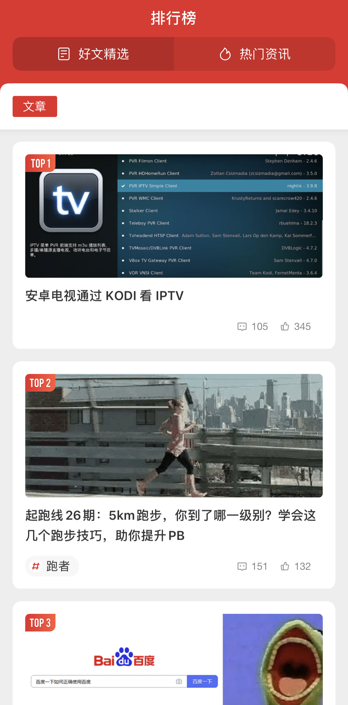

## 目标

- 了解掌握选择器类型的使用方法
- 了解掌握CSS层叠与继承
- 了解掌握盒子模型的概念
- 了解掌握背景和边框

### 常用选择器类型

https://developer.mozilla.org/zh-CN/docs/Learn/CSS/Building_blocks/Selectors

CSS选择器是CSS规则的第一部分。它是元素和其他部分组合起来告诉浏览器哪个HTML元素应当是被选为应用规则中的CSS属性值的方式。选择器所选择的元素，叫做“选择器的对象”。下面我们介绍几种常见的选择器类型。

- 类型选择器，通过node节点名称匹配元素. 因此,在单独使用时,寻找特定类型的元素时,元素选择器都会匹配该文档中所有此类型的元素
  
  ```
  h1 {
    color: red;
  }
  ```

- ID选择器，在一个HTML文档中,CSS ID 选择器会根据该元素的 ID 属性中的内容匹配元素,元素 ID 属性名必须与选择器中的 ID 属性名完全匹配，此条样式声明才会生效。
  
  ```
  #demo {
    border: red 2px solid;
  }
  ```

- 类选择器，在一个HTML文档中，CSS类选择器会根据元素的类属性中的内容匹配元素。类属性被定义为一个以空格分隔的列表项，在这组类名中，必须有一项与类选择器中的类名完全匹配，此条样式声明才会生效。以下示例中的三个选择器所起的作用各不相同
  
  ```
  .classy {
    background-color: red;
  }
  
  div .classy {
    background-color: blue;
  }
  
  span.classy {
    background-color: green;
  }
  ```
  
  ```
  <div class="classy">
    <div>AAAAA</div>
    <div>
      <p class="classy">BBB</p>
    </div>
    <span class="classy">CCC</span>
  </div>
  ```

- 属性选择器，通过已经存在的属性名或属性值匹配元素。
  
  ```
  a[title] {
    color: purple;
  }
  ```

- 伪类，伪类是添加到选择器的关键字，指定要选择的元素的特殊状态。例如，`:hover` 可被用于在用户将鼠标悬停在按钮上时改变按钮的颜色。
  
  ```
  /* 所有用户指针悬停的按钮 */
  button:hover {
    color: blue;
  }
  ```
  
  伪类连同伪元素一起，他们允许你不仅仅是根据文档 DOM 树中的内容对元素应用样式，而且还允许你根据诸如像导航历史这样的外部因素来应用样式（例如 `:visited`），同样的，可以根据内容的状态（例如在一些表单元素上的 `:checked`），或者鼠标的位置（例如 `:hover` 让你知道是否鼠标在一个元素上悬浮）来应用样式。更多关于伪类的用法参考： https://developer.mozilla.org/zh-CN/docs/Web/CSS/Pseudo-classes

- 伪元素，伪元素是一个附加至选择器末的关键词，允许你对被选择元素的特定部分修改样式。下例中的 `::after` 用来创建一个伪元素，作为已选中元素的最后一个子元素。通常会配合content属性来为该元素添加装饰内容。这个虚拟元素默认是行内元素。
  
  ```
  /* 在每个链接的末尾添加一个箭头 */
  a::after {
    content: "→";
  }
  ```

- 后代选择器，后代组合器（通常用单个空格字符表示）组合了两个选择器，如果第二个选择器匹配的元素具有与第一个选择器匹配的祖先元素，则它们将被选择。利用后代组合器的选择器称为后代选择器。
  
  ```
  /* 选择p元素下的所有div元素 */
  div p {
    border: 1px solid red;
  }
  ```

- 子选择器，当使用 `>` 选择符分隔两个元素时，它只会匹配那些作为第一个元素的直接后代(子元素)的第二元素。与之相比，当两个元素由 `后代选择器` 相连时，它表示匹配存在的所有由第一个元素作为祖先元素(但不一定是父元素)的第二个元素, 无论它在 DOM 中"跳跃" 多少次
  
  ```
  /* 选择p元素下的第一级子div元素 */
  p > div {
    border: 1px solid red;
  }
  ```

> 练习

自己练习，尝试使用不同的选择写样式，看看他们展示的效果

### 层叠与继承

#### 层叠

简单的说，css规则的顺序很重要；当应用两条同级别的规则到一个元素的时候，写在后面的就是实际使用的规则。下面的例子中，我们有两个关于 h1 的规则。h1 最后显示蓝色 — 这些规则有相同的优先级，所以顺序在最后的生效。

```
h1 { 
  color: red; 
}
h1 { 
  color: blue; 
}
<h1>This is my heading.</h1>
```

#### 优先级

浏览器是根据优先级来决定当多个规则有不同选择器对应相同的元素的时候需要使用哪个规则。它基本上是一个衡量选择器具体选择哪些区域的尺度：

- 一个元素选择器不是很具体 — 会选择页面上该类型的所有元素 — 所以它的优先级就会低一些。
- 一个类选择器稍微具体点 — 它会选择该页面中有特定 class 属性值的元素 — 所以它的优先级就要高一点。

下面我们再来介绍两个适用于 h1 的规则。下面的 h1 最后会显示红色 — 类选择器有更高的优先级，因此就会被应用——即使元素选择器顺序在它后面。

```
.main-heading { 
  color: red; 
}

h1 { 
  color: blue; 
}
<h1 class="main-heading">This is my heading.</h1>
```

这里需要注意虽然我们考虑的是选择器，以及应用在选中对象上的规则，但不会覆盖所有规则，只有相同的属性。

这样可以避免重复的 CSS。一种常见的做法是给基本元素定义通用样式，然后给不同的元素创建对应的类。举个例子，在下面的样式中我给2级标题定义了通用样式，然后创建了一些类只修改部分属性的值。最初定义的值应用于所有标题，然后更具体的值通过对应类来实现。

```
h2 {
  font-size: 2em;
  color: #000;
  font-family: Georgia, 'Times New Roman', Times, serif;
}

.small {
  font-size: 1em;
}

.bright {
  color: rebeccapurple;
} 
<h2>Heading with no class</h2>
<h2 class="small">Heading with class of small</h2>
<h2 class="bright">Heading with class of bright</h2>
```

现在让我们来看看浏览器如何计算优先级。我们已经知道一个元素选择器比类选择器的优先级更低会被其覆盖。本质上，不同类型的选择器有不同的分数值，把这些分数相加就得到特定选择器的权重，然后就可以进行匹配。

一个选择器的优先级可以说是由四个部分相加 (分量)，可以认为是个十百千 — 四位数的四个位数：

- **千位：** 如果声明在 style 的属性（内联样式）则该位得一分。这样的声明没有选择器，所以它得分总是1000。
- **百位**： 选择器中包含ID选择器则该位得一分。
- **十位**： 选择器中包含类选择器、属性选择器或者伪类则该位得一分。
- **个位**：选择器中包含元素、伪元素选择器则该位得一分。

> 警告: 在进行计算时不允许进行进位，例如，20 个类选择器仅仅意味着 20 个十位，而不能视为 两个百位，也就是说，无论多少个类选择器的权重叠加，都不会超过一个 ID 选择器。

| 选择器                                     | 千位  | 百位  | 十位  | 个位  | 优先级  |
| --------------------------------------- | --- | --- | --- | --- | ---- |
| h1                                      | 0   | 0   | 0   | 1   | 0001 |
| h1 + p::first-letter                    | 0   | 0   | 0   | 3   | 0003 |
| li > a[href*="en-US"] > .inline-warning | 0   | 0   | 2   | 2   | 0022 |
| #identifier                             | 0   | 1   | 0   | 0   | 0100 |
| 内联样式                                    | 1   | 0   | 0   | 0   | 1000 |

有一个特殊的 CSS 可以用来覆盖所有上面所有优先级计算 `!important`。用于修改特定属性的值，能够覆盖普通规则的层叠。

**注意：除非特殊情况，否则不应该在常规代码中使用 `!important`**

> **思考：下面选择器的优先级各是多少？**

- **`#container .title`**

- **`h1.title > span`**
  
  ***\*注意：学习优先级的规则是为了让大家理解CSS的工作机制，实际开发中尽可能避免使用复杂的选择器，会降低代码的可读性，保持简单易懂！\****

#### **继承**

**一些设置在父元素上的css属性是可以被子元素继承的，比如 `color`、`font-size`，每个在里面的元素也都会有相同的属性，除非你直接在元素上设置属性。有些属性如 `width`、`margin`、`border`等，则不会被继承，举例如下**

```
body {
  color: blue;
}

span {
  color: black;
}
```

```
<p>
  As the body has been set to have a color of blue this is inherited through the descendants.
</p>
<p>
  We can change the color by targetting the element with a selector, such as this <span>span</span>.
</p>
```

> 练习

自己练习，看看样式继承的影响

##### **CSS位置的影响**

**CSS声明的重要性取决于样式表中指定的——它让用户可以设置自定义样式表来覆盖开发人员定义的样式。相互冲突的声明将按以下顺序适用，后一种声明将覆盖前一种声明：**

- **用户代理样式表中的声明(例如，浏览器的默认样式，在没有设置其他样式时使用)。**
- **用户样式表中的常规声明(由用户设置的自定义样式)。**
- **作者样式表中的常规声明(这些是我们web开发人员设置的样式)。**
- **作者样式表中的!important声明**
- **用户样式表中的!important 声明**

**对于web开发人员的样式表来说，覆盖用户样式表是有意义的，因此设计可以按预期进行，但是有时用户充足的理由覆盖web开发人员样式，正如上面提到的—这可以通过在他们的规则中使用!important来实现。**

### **盒子模型**

**在 CSS 中，所有的元素都被一个个的“盒子（box）”包围着，理解这些“盒子”的基本原理，是我们使用CSS实现准确布局、处理元素排列的关键。**

**https://developer.mozilla.org/zh-CN/docs/Learn/CSS/Building_blocks/The_box_model**

**在 CSS 中我们广泛地使用两种“盒子” —— 块级盒子 (block box) 和 内联盒子 (inline box)。这两种盒子会在页面流（page flow）和元素之间的关系方面表现出不同的行为:**

#### **块级盒子（Block box）**

**一个被定义成块级的（block）盒子会表现出以下行为:**

- **盒子会在内联的方向上扩展并占据父容器在该方向上的所有可用空间，在绝大数情况下意味着盒子会和父容器一样宽**
- **每个盒子都会换行**
- **`width` 和 `height` 属性可以发挥作用**
- **内边距 `padding`, 外边距 `margin` 和 边框 `border` 会将其他元素从当前盒子周围“推开”**

**除非特殊指定，诸如标题(`<h1>`等)和段落(`<p>`)默认情况下都是块级的盒子。**

#### **内联盒子（Inline box）**

**如果一个盒子对外显示为 `inline`，那么他的行为如下:**

- **盒子不会产生换行。**
- **`width` 和 `height` 属性将不起作用。**
- **垂直方向的内边距、外边距以及边框会被应用但是不会把其他处于 inline 状态的盒子推开。**
- **水平方向的内边距、外边距以及边框会被应用且会把其他处于 inline 状态的盒子推开。**

**用做链接的 `<a>` 元素、 `<span>`、 `<strong>` 都是默认处于 `inline` 状态的**

**我们通过对盒子 `display` 属性的设置，比如 `inline` 或者 `block` ，来控制盒子的外部显示类型。**

#### **盒子模型的组成部分**

- ***\*Content box\**：这个区域是用来显示内容，大小可以通过设置 `width` 和 `height`.**

- ***\*Padding box\**: 包围在内容区域外部的空白区域； 大小通过 `padding` 相关属性设置。**

- ***\*Border box\**: 边框盒包裹内容和内边距。大小通过 `border` 相关属性设置。**

- ***\*Margin box\**: 这是最外面的区域，是盒子和其他元素之间的空白区域。大小通过 `margin` 相关属性设置。**
  
  

#### **标准盒子模型**

**在标准模型中，如果你给盒设置 `width` 和 `height`，实际设置的是 `content box`。 `padding` 和 `border` 再加上设置的宽高一起决定整个盒子的大小。 见下图。**

  

**假设定义了 `width`, `height`, `margin`, `border`, `padding`:**

```
.box {
  width: 350px;
  height: 80px;
  margin: 25px;
  padding: 25px;
  border: 5px solid black;
}
```

**如果使用标准模型宽度 = 410px (350 + 25 + 25 + 5 + 5)，高度 = 140px (80 + 25 + 25 + 5 + 5)，`padding` 加 `border` 再加 `content box`。**

> ***\*注\**: margin 不计入实际大小 —— 当然，它会影响盒子在页面所占空间，但是影响的是盒子外部空间。盒子的范围到边框为止 —— 不会延伸到margin。**

#### **替代盒子模型**

**你可能会认为盒子的大小还要加上边框和内边距，这样很麻烦，而且你的想法是对的! 因为这个原因，css还有一个替代盒模型。使用这个模型，所有宽度都是可见宽度，所以内容宽度是该宽度减去边框和填充部分。使用上面相同的样式得到 (width = 350px, height = 80px)。**

  ****

**默认浏览器会使用标准模型。如果需要使用替代模型，您可以通过为其设置 `box-sizing`: `border-box` 来实现。 这样就可以告诉浏览器使用 `border-box` 来定义区域，从而设定您想要的大小。**

**如果你希望所有元素都使用替代模式，而且确实很常用，设置 box-sizing 在 `<html>` 元素上，然后设置所有元素继承该属性，正如下面的例子。**

```
html {
  box-sizing: border-box;
}

*, *::before, *::after {
  box-sizing: inherit;
}
```

### **背景和边框**

**在这一部分内容中，我们来使用CSS背景和边框来做一些具有一些创造性的事情。渐变、背景图像和圆角，背景和边框的巧妙运用是CSS中许多样式问题的答案。https://developer.mozilla.org/zh-CN/docs/Learn/CSS/Building_blocks/Backgrounds_and_borders**

#### **背景颜色**

**`background-color` 属性定义了CSS中任何元素的背景颜色。属性接受任何有效的`color` 值。背景色扩展到元素的内容和内边距的下面。**

> **如果除了背景图像外，还指定了背景颜色，则图像将显示在颜色的顶部。尝试向上面的示例添加一个 `background-color` 属性，看看效果如何。**

#### **背景图片**

**`background-image` 属性允许在元素的背景中显示图像。默认情况下，大图不会缩小以适应方框，因此我们只能看到它的一个小角，而小图则是平铺以填充方框。在这种情况下，实际的图像只是单独的一颗星星。**

#### **渐变背景**

**当渐变用于背景时，也可以使用像图像一样的 `background-image` 属性设置，具体可以参考示例代码。**

#### **background 简写**

**此属性是一个 简写属性，可以在一次声明中定义一个或多个属性：`background-clip`、`background-color`、`background-image`、`background-origin`、`background-position`、`background-repeat`、`background-size`，和 `background-attachment`**

**对于所有简写属性，任何没有被指定的值都会被设定为它们的初始值**

```
/* 使用 <background-color> */
background: green;

/* 使用 <bg-image> 和 <repeat-style> */
background: url("test.jpg") repeat-y;
```

#### **边框**

**在学习盒子模型时，我们发现了边框如何影响盒子的大小。在这节课中，我们将看看如何创造性地使用边界。通常，当我们使用CSS向元素添加边框时，我们使用一个简写属性在一行CSS中设置边框的颜色、宽度和样式。我们可以使用 `border` 为一个框的所有四个边设置边框。**

```
.box {
  border: 1px solid black;
} 
```

**或者我们可以只设置盒子的一个边，例如:**

```
.box {
  border-top: 1px solid black;
} 
```

**这些简写的等价于：**

```
.box {
  border-width: 1px;
  border-style: solid;
  border-color: black;
}
```

**也可以使用更加细粒度的属性：**

```
.box {
  border-top-width: 1px;
  border-top-style: solid;
  border-top-color: black;
}
```

#### **圆角**

**通过使用 `border-radius` 属性和与方框的每个角相关的长边来实现方框的圆角。可以使用两个长度或百分比作为值，第一个值定义水平半径，第二个值定义垂直半径。在很多情况下，您将只传递一个值，这两个值都将使用。https://developer.mozilla.org/zh-CN/docs/Web/CSS/border-radius**

****

**例如，要使一个盒子的四个角都有10px的圆角半径：**

```
.box {
  border-radius: 10px;
} 
```

**或使右上角的水平半径为1em，垂直半径为10％：**

```
.box {
  border-top-right-radius: 1em 10%;
} 
```

#### **阴影**

**https://developer.mozilla.org/zh-CN/docs/Web/CSS/box-shadow**

**CSS `box-shadow` 属性用于在元素的框架上添加阴影效果。你可以在同一个元素上设置多个阴影效果，并用逗号将他们分隔开。该属性可设置的值包括阴影的X轴偏移量、Y轴偏移量、模糊半径、扩散半径和颜色，基本语法如下**

```
.box {
  /* x偏移量 | y偏移量 | 阴影模糊半径 | 阴影扩散半径 | 阴影颜色 */
  box-shadow: 2px 2px 2px 1px rgba(0, 0, 0, 0.2);
}

.inset {
  /* 内阴影 | x偏移量 | y偏移量 | 阴影模糊半径 | 阴影扩散半径 | 阴影颜色 */
  box-shadow: inset 2px 2px 2px 1px rgba(0, 0, 0, 0.2);
}
```

**取值**

- **`inset`：如果没有指定inset，默认阴影在边框外，即阴影向外扩散。 使用 inset 关键字会使得阴影落在盒子内部，这样看起来就像是内容被压低了。 此时阴影会在边框之内 (即使是透明边框）、背景之上、内容之下。**
- **`offset-x`、`offset-y`：这是头两个 `length` 值，用来设置阴影偏移量。x,y 是按照数学二维坐标系来计算的，只不过y垂直方向向下。`offset-x` 设置水平偏移量，正值阴影则位于元素右边，负值阴影则位于元素左边。 `offset-y` 设置垂直偏移量，正值阴影则位于元素下方，负值阴影则位于元素上方。如果两者都是0，那么阴影位于元素后面。**
- **`blur-radius`：这是第三个 `length` 值。值越大，模糊面积越大，阴影就越大越淡。 不能为负值。默认为0，此时阴影边缘锐利。本规范不包括如何计算模糊半径的精确算法。**
- **`spread-radius`：这是第四个 `length` 值。取正值时，阴影扩大；取负值时，阴影收缩。默认为0，此时阴影与元素同样大。**
- **`color`：指定阴影颜色。**

**`box-shadow` 参数可以简写，也可以对同一个元素添加多个阴影效果，请使用逗号将每个阴影规则分隔开。https://developer.mozilla.org/zh-CN/docs/Web/CSS/box-shadow#syntax**

> **练习：尝试设置不同的阴影参数查看效果**

我们来了解一下CSS中另外一个重要的概念——溢出。溢出是在盒子无法容纳下太多的内容的时候发生的。在这篇教程里面，你将会学习到什么是溢出，以及如何控制它。

#### 什么是溢出

我们知道，CSS中万物皆盒，因此我们可以通过给 `width` 和 `height` 赋值的方式来约束盒子的尺寸。溢出是在你往盒子里面塞太多东西的时候发生的，所以盒子里面的东西也不会老老实实待着。CSS给了你好几种工具来控制溢出，在学习的早期理解这些概念是很有用的。在你写CSS的时候你经常会遇到溢出的情形，尤其是当你以后更加深入到CSS布局的时候。

#### overflow 属性

`overflow` 属性是你控制一个元素溢出的方式，它告诉浏览器你想怎样处理溢出。 `overflow` 的默认值为 `visible`，这就是我们的内容溢出的时候，我们在默认情况下看到它们的原因。

如果你想在内容溢出的时候把它裁剪掉，你可以在你的盒子上设置 `overflow: hidden`。这就会像它表面上所显示的那样作用——隐藏掉溢出。这可能会很自然地让东西消失掉，所以你只应该在判断隐藏内容不会引起问题的时候这样做。

如果你想在有比盒子所能装下更多的内容的时候显示滚动条，那么使用 `overflow: auto`。此时由浏览器决定是否显示滚动条。桌面浏览器一般仅仅会在有足以引起溢出的内容的时候这么做。

## 课后任务

目标页面为 `什么值得买` 排行榜 `社区` 页面，做了一些简化，效果参考 `practice.jpg`


- 参考 `demo/demo-flex01` 的代码，自己从头开始编写
- 页面数据可自行收集填充
- 相关图标在 `imgs` 目录或 `icons` 图标库中已有提供
- 代码放在 `work-02` 目录下
- 代码在第二天中午12点之前推送至Git服务的个人作业仓库
