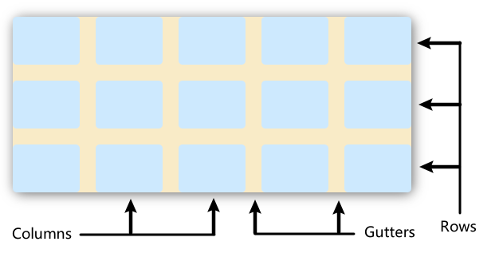

# CSS进阶-Grid布局

## 目标

- 了解掌握Grid布局的用法
- 掌握Grid响应式布局技巧

## Grid 基础

[https://developer.mozilla.org/zh-CN/docs/Learn/CSS/CSS_layout/Grids](https://developer.mozilla.org/zh-CN/docs/Learn/CSS/CSS_layout/Grids)

网格布局（Grid）是最强大的 CSS 布局方案。它将网页划分成一个个网格，可以任意组合不同的网格，做出各种各样的布局。
Grid 布局与 Flex 布局有一定的相似性，都可以指定容器内部多个项目的位置。但是，它们也存在重大区别。
Flex 布局是轴线布局，只能指定"item"针对轴线的位置，可以看作是一维布局。Grid 布局则是将容器划分成"行"和"列"，产生单元格，然后指定"项目所在"的单元格，可以看作是二维布局。Grid 布局远比 Flex 布局强大。



CSS网格是一个用于web的二维布局系统。利用网格，你可以把内容按照行与列的格式进行排版。另外，网格还能非常轻松地实现一些复杂的布局。这一部分介绍关于使用网格进行页面排版的基本内容。

网格是由一系列水平及垂直的线构成的以一种布局模式。根据网格，我们能够将设计元素进行排列，帮助我们设计一系列具有固定位置以及宽度的元素的页面，使我们的网站页面更加统一。

一个网格通常具有许多的列（`column`）与行（`row`），以及行与行、列与列之间的间隙，这个间隙一般被称为沟槽（`gutter`）。

决定好你的设计所需要的网格后，你可以创建一个CSS网格版面并放入各类元素。我们先来看看网格的基础功能，然后尝试做一个简单的网格系统。

### 定义一个网格

首先，将容器的 `display` 属性设置为 `grid` 来定义一个网络。与弹性盒子一样，将父容器改为网格布局后，他的直接子项会变为网格项。把下面的css规则加到你的文件中。

```css
.container {
  display: grid;
}
```

与弹性盒子不同的是，在定义网格后，网页并不会马上发生变化。因为 `display: grid` 的声明只创建了一个只有一列的网格，所以你的子项还是会像正常布局流那样从上而下一个接一个的排布。

为了让我们的容器看起来更像一个网格，我们要给刚定义的网格加一些列。那就让我们加三个宽度为 `200px` 的列。当然，这里可以用任何长度单位，包括百分比。

```css
.container {
  display: grid;
  grid-template-columns: 200px 200px 200px;
}
```

### 使用fr单位的灵活网格

除了长度和百分比，我们也可以用fr这个单位来灵活地定义网格的行与列的大小。这个单位表示了可用空间的一个比例，可能有点抽像，看看下面的例子吧。

使用下面的规则来创建3个1fr的列：

```css
.container {
  display: grid;
  grid-template-columns: 1fr 1fr 1fr;
}
```

每一列的宽度可以会随着可用空间变小而变小。`fr` 单位按比例划分了可用空间，这个与弹性盒子布局中的 `flex` 属性类似，再看下面的代码

```css
.container {
  display: grid;
  grid-template-columns: 2fr 1fr 1fr;
}
```

这个定义里，第一列被分配了 `2fr` 可用空间，余下的两列各被分配了 `1fr` 的可用空间，这会使得第一列的宽度是第二第三列的两倍。另外，`fr` 可以与一般的长度单位混合使用，比如 `grid-template-columns: 300px 2fr 1fr`，那么第一列宽度是 `300px`，剩下的两列会根据除去 `300px` 后的可用空间按比例分配。

### 网格间隙

使用 `column-gap` 属性来定义列间隙；使用 `row-gap` 来定义行间隙；使用 `gap` 可以同时设定两者。

```css
.container {
  display: grid;
  grid-template-columns: 2fr 1fr 1fr;
  gap: 20px;
}
```

### 重复构建列

你可以使用 `repeat` 来重复构建具有某些宽度配置的某些列。举个例子，如果要创建多个等宽轨道，可以用下面的方法。

```css
.container {
  display: grid;
  grid-template-columns: repeat(3, 1fr);
  gap: 20px;
}
```

和之前一样，你仍然得到了3个 `1fr` 的列。第一个传入 `repeat` 函数的值（`3`）表明了后续列宽的配置要重复多少次，而第二个值（`1fr`）表示需要重复的构建配置，这个配置可以具有多个长度设定。例如 `repeat(2, 2fr 1fr)`，如果你仍然不明白，可以实际测试一下效果，这相当于填入了 `2fr 1fr 2fr 1fr`。

### 课堂练习

> 使用grid实现圣杯布局

圣杯布局将页面分成五个部分，除了页眉和页脚，内容区分成左边栏、主栏、右边栏。

- 可以使用[grid-columns](https://developer.mozilla.org/en-US/docs/Web/CSS/grid-column)指定每个item的位置;
- 也可使用[grid-template-areas](https://developer.mozilla.org/en-US/docs/Web/CSS/grid-template-areas).

## Grid 响应式布局

前面我们学习了Grid布局的基本使用，实际上Grid还有很多更高级的特性，可以让我们直接创建简单的响应式的布局，下面我们来学习一下。

### 显式网格与隐式网格

前面我们已经学习过如何定义网格的列，但是还没有考虑过行的问题，在这之前，我们要来理解一下显式网格和隐式网格。显式网格是我们用 `grid-template-columns` 或 `grid-template-rows` 属性创建的，而隐式网格则是当有内容被放到网格外时才会生成的，显式网格和隐式网格的关系与弹性盒子的主轴和交叉轴的关系有些类似。

隐式网格生成的行/列大小时参数默认是 `auto` ，大小会根据放入的内容自动调整。当然，你也可以使用 `grid-auto-rows` 和 `grid-auto-columns` 属性手动设定隐式网格的大小。下面的例子将 `grid-auto-rows` 设为了 `100px`，然后你可以看到那些隐式网格中的行现在都是100像素高了。

简单来说，隐式网格就是为了放显式网格放不下的元素，浏览器根据已经定义的显式网格自动生成的网格部分，比如下面的例子，我们只显式设定了网格为3列，每行的高度是100px，但是当我们在网格里面放入超过3个子项之后，多余的子项会按照已经定义的网格自动排列。

```css
.container {
  display: grid;
  grid-template-columns: repeat(3, 1fr);
  grid-auto-rows: 100px;
  gap: 20px;
}
```

### minmax函数

上面的例子我们设定了每一行的高度为100px，但有时候设置的固定宽度或高度可能会不够用，所以，我们希望可以将其设定为至少100像素，而且可以跟随内容来自动拓展尺寸来保证容纳所有内容。显而易见，你很难知道网页上某个元素的尺寸在不同情况下会变成多少，所以，我们有了 `minmax` 函数。

`minmax` 函数为一个行/列的尺寸设置了取值范围，比如设定 `minmax(100px, auto)`，那么尺寸就至少为100像素，并且如果内容尺寸大于100像素则会根据内容自动调整，这里试一下把 `grid-auto-rows` 属性设置为 `minmax` 函数，然后来看一下效果。

```css
.container {
  display: grid;
  grid-template-columns: repeat(3, 1fr);
  grid-auto-rows: minmax(100px, auto);
  gap: 20px;
}
```

如果所有网格内的内容均小于100像素，那么看起来不会有变化，但如果其中某一项放入很长的内容或者图片，你可以看到这个格子所在的那一行的高度编程能刚好容纳内容的高度了。注意我们修改的是 `grid-auto-rows`，因此只会作用于隐式网格，当然，这一属性也可以应用于显式网格。

### 自动多列填充

我们可以把 `repeat` 和 `minmax` 结合起来，实现一个非常有用的功能，某些情况下，我们需要让网格自动创建很多列来填满整个容器。通过设置 `grid-template-columns` 属性，我们可以实现这个效果，不过这一次我们会用到 `repeat` 函数中的一个关键字 `auto-fill` 来替代确定的重复次数。而函数的第二个参数，我们使用 `minmax` 函数来设定一个行/列的最小是以及最大值 `1fr`。

我们来尝试一下下面的代码：

```css
.container {
  display: grid;
  grid-template-columns: repeat(auto-fill, minmax(200px, 1fr));
  grid-auto-rows: minmax(100px, auto);
  gap: 20px;
}
```

你应该能看到形成了一个至少200像素宽的列的网格，将容器填满。随着容器宽度的改变，网格会自动根据容器宽度进行调整，每一列的宽度总是大于200像素，并且容器总会被列填满，这样就可以实现响应式布局的效果。

> flex是一维布局，适合做局部布局；grid是二维布局，通常用于做整体页面规划。

## 课后任务

1. 目标页面为 `QQ音乐` 的简化版。
    
    - 页面数据在`task/task-grid/01/task.json`
    - 样式特效参考demo
    - 代码放在 `work-05/01` 目录下
    - 将代码编写思路记录在01的readme中
2. `iconfont首页简化版`
    
    - 页面数据通过network网络分析获取
    - 样式效果参考官网(需要完成切换卡片的效果，官网目前无法切换)
    - 代码放在 `work-05/02`目录下
    - 将代码编写思路记录在02的readme中