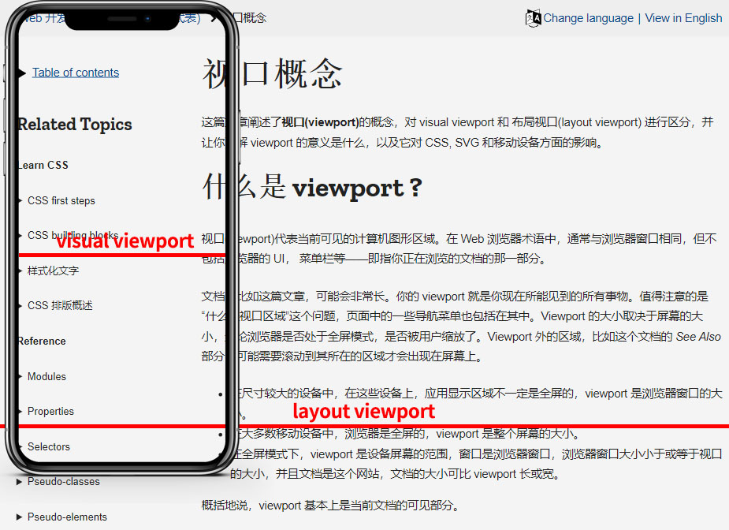

# 移动端适配

## 目标

- 掌握媒体查询的语法
- 掌握移动端适配相关知识点

## 响应式设计概念

早年设计Web时，页面是以适配特定的屏幕大小为考量创建的，只有在符合设计者适配的屏幕上面，页面才能很好的表现。如果用户正在使用比设计者考虑的更小或者更大的屏幕，那么结果通常出现多余滚动条、过长的行或者没有合理利用的空间等等。随着人们使用的屏幕尺寸的种类越来越多，出现了响应式设计的概念（Responsive Web Design)，它指的是允许Web页面适应不同屏幕宽度因素等，进行布局和外观的调整的一系列实践，这是改变我们设计多设备网页的方式的思想。响应式设计并不是指某一项特定的技术，而是设计网页的一种方式，比如通过媒体查询、Flex、Grid都可以实现一定的响应式设计的效果。

> “Content is like Water. You put water into a cup it becomes the cup. You put water into a bottle it becomes the bottle. You put it in a teapot, it becomes the teapot.” 
>
> Stephanie Walter, Web Designer

### 历史上的网站布局

在历史上，特别是CSS3出现以前，设计网站排版时，你通常有两个选择：

- 你可以创建一个动态伸缩的页面，如使用百分比，它会拉伸以充满整个浏览器视窗
- 或者是创建一个固定宽度的页面，他有一个以像素为单位的固定尺寸。

这两种途径会导致它的表现只有在设计者的屏幕上才是最佳的，动态伸缩的屏幕导致了在小屏幕上的设计会挤成一团，以及在大屏幕上难以阅读的很长的行。

固定宽度页面的一个可能后果是，在比站点更窄的屏幕上会出现一个水平滚动条，在大屏幕上的设计边缘还会出现许多空白。参考我们上一节课的demo页面，调整浏览器窗口的尺寸，看看会出现什么效果。

随着智能设备的兴起，移动Web开始成为现实，希望拥抱移动端的公司普遍希望为他们的网站增加对移动端的支持，一开始只能开发两个不同的版本，分别支持PC端和移动端，使用不同的域名进行区分，比如 `a.example.com` ，这意味着一个网站需要开发两个分开的版本，而且要同时保持时效性，非常的麻烦。

除此之外，这些移动端的网站体验经常缩水，为了适配手机的小屏幕，常常只能展示非常少的信息，而由于移动设备变得越来越强大，足以显示完整的网站，反而限制了移动端用户的访问，他们无法获取仅在桌面端网站上才能找到的信息。

CSS3的出现引入了一些新的布局技术，如 `Flex`、`Grid`，自身就是支持响应式的，使得我们现在设计响应式页面变得更加的容易。现在常见的设备有 `PC`、`手机`、`平板`、`电视`，有的甚至还需要考虑车载设备或者打印机印刷输出，而高分屏的普及也带来了新的适配问题。

## 媒体查询

[https://developer.mozilla.org/zh-CN/docs/Learn/CSS/CSS_layout/Media_queries](https://developer.mozilla.org/zh-CN/docs/Learn/CSS/CSS_layout/Media_queries)

响应式设计仅仅是因为媒体查询才兴起的，它允许我们运行一系列的测试，例如用户的屏幕是否大于某个宽度或者某个分辨率，并将CSS选择性地应用在所需页面上。

例如，下面的媒体查询进行测试，以知晓当前的Web页面是否被展示为屏幕媒体（也就是说不是印刷文档），且视口至少有800像素宽，用于 `.container` 选择器的CSS将只会在满足这两个条件的前提下被应用

```css
@media screen and (min-width: 800px) {
  .container {
    margin: 1em 2em;
  }
}
```

你可以在一张样式表上加入多条媒体查询，调整整个页面或者部分页面以达到适应各式屏幕尺寸的最佳效果，媒体查询样式改变时的点，被叫做断点（`breakpoints`）。

媒体查询时响应式设计的关键组成部分，使用媒体查询时的一种通用方式是，为窄屏设备（例如移动设备）创建一个简单的单栏布局，然后检查是否为更大的屏幕，在你知道有足够的屏幕宽度时，开始采用一种多栏的布局，这经常被描述为 `移动优先` 设计。

### 媒体查询基础

上面我们已经简单体验了一下媒体查询的用法，最简单的媒体查询语法看起来像是这样子的：

```css
@media media-type and (media-feature-rule) {
  /* CSS rules go here */
}
```

它由以下部分组成：

- 一个媒体类型，告诉浏览器这段代码是用在什么类型的媒体上的（例如屏幕或者印刷品）
- 一个媒体表达式，是一个被包含的CSS生效所需的规则或测试
- 一组CSS规则，会在测试通过且媒体类型正确的时候应用

#### 媒体类型

常见的媒体类型有：

- `all`：所有类型设备
- `print`：打印预览模式
- `screen`：屏幕设备，是我们最常用的类型

下面的媒体查询会在页面被打印的时候把 `body` 设定为 `12pt` 大小，当页面在浏览器载入的时候，他将不会生效

```css
@media print {
  body {
    font-size: 12pt;
  }
}
```

#### 媒体特征规则

在指定了媒体类型之后，你可以用一条规则指向一种媒体特征。为了建立响应式设计，我们一般最常探测的特征是视口宽度，而且我们可以使用 `min-width`、`max-width` 和 `width` 媒体特征，在视口宽度大于或者小于某个大小，或者恰好处于某个大小的时候，应用CSS。

这些特征是用来创建响应不同屏幕大小的布局的，例如，想要在视口正好是600像素的时候，让 `body` 的文本变为红色，你可以使用下面的媒体查询。

```css
@media screen and (width: 600px) {
  body {
    color: red;
  }
}
```

`width` 和 `height` 媒体特征可以以数值范围使用，于是就有了 `min-` 和 `max-` 的前缀，指示所给的值是最大值还是最小值。例如，要让颜色在视口窄于400像素的时候变成蓝色，可以用 `max-width`：

```css
@media screen and (max-width: 400px) {
  body {
    color: blue;
  }
}
```

实践中，使用最大值和最小值是最常用的，很少有 `width` 、`height` 单独使用的情况。

还有一个普遍使用的媒体特征是 `orientation`，我们可以使用它测试竖放（`portrait mode`）和横放（`landscape mode`）模式，例如，如果要在设备处于横向的时候改变 `body` 文本颜色的话，可使用下面的媒体查询。

```css
@media screen (orientation: landscape) {
  body {
    color: red;
  }
}
```

还有许多其他的媒体特征可供测试，但是浏览器支持的仍然有限，通过上面的视口尺寸和方向特征，已经可以满足我们绝大多数使用场景了。

### 更复杂的媒体查询

前面的例子我们看到，每次只使用了一个媒体特征，但实际上不同的媒体特征可以组合来用，支持“或与非”逻辑判断。

#### 媒体查询中的“与”逻辑

你可以使用 `and` 来组合媒体类型和特征，例如，我们想要测得 `min-width` 和 `orientation`，而 `body` 的文字只会在视口至少400像素宽，且设备横放时变为蓝色，那么规则可以这么来写：

```css
@media screen and (min-width: 400px) and (orientation: landscape) {
  body {
    color: blue;
  }
}
```

#### 媒体查询中的“或”逻辑

如果你有一组查询，且要其中任何一个都可以匹配的话，那么你可以使用逗号分开这些查询。在下面的例子中，文本会在视口至少400像素宽的时候，或者设备处于横放状态的时候变为蓝色，如果其中一项满足，那么查询就匹配上了。

```css
@media screen and (min-width: 400px), screen and (orientation: landscape) {
  body {
    color: blue;
  }
}
```

#### 媒体查询中的“非”逻辑

你可以用 `not` 操作符让整个媒体查询失效，这样就直接反转了整个媒体查询的含义，在下面的例子中，文本值会在竖向的时候变为蓝色。

```css
@media not all and (orientation: landscape) {
  body {
    color: blue;
  }
}
```

### 如何选择断点

响应式设计的早期，许多设计者会尝试指向非常特定的屏幕尺寸，基于流行的手机和平板的屏幕尺寸列表，以让设计者创建可以整齐地放在那些视口里面的设计。

现在智能移动设备发展迅速，同时带来的屏幕尺寸碎片化非常严重，让这种事情变得不再可行。也就是说，将所有的设计用在特定的尺寸上以外，一个更好的方法是在内容某种程度上开始变得混乱的时候，改变尺寸的设计。也许线太长了，或者盒子挤在一起而难以阅读，那就是你想要使用媒体查询，将设计变得对剩余可用空间更加友好的时候。这种方式意味着，它无关使用的设备屏幕的确切大小，每个范围都会被照顾到，引入媒体查询的点就叫做**断点**。

通过chrome开发者工具的**响应式设计模式**可以很好地弄清楚断点应该设置在哪里，你能很容易地改变视口的大小，然后看下可以在哪里加入媒体查询、调整设计，从而改善内容的表现效果。

> 通过调整MDN的页面尺寸来观察它的响应式变化。

一般来说我们主要考虑5种类型的设备屏幕，各自对应的分辨率通常为：

- mobile portrait：竖屏移动设备，< 640px
- mobile landscape：横屏移动设备，> 640px
- tablet portrait：竖屏平板设备，> 768px
- tablet landscape：横屏平板设备，> 1024px
- laptop：PC电脑，> 1280px

所以，如果你想要自己的页面能够在这几种屏幕上都能够很好适配的话，可以优先针对竖屏移动设备编写CSS，然后再使用下面几种媒体查询断点，适配更大尺寸的屏幕：

```css
@media screen and (min-width: 640px) {

}

@media screen and (min-width: 768px) {

}

@media screen and (min-width: 1024px) {

}

@media screen and (min-width: 1280px) {
  
}
```

### 移动优先的设计

简单来说，你可以采用两种方式来实现响应式设计，你可以从桌面或者最宽的试图开始，然后随着视口变得越来越小，加上断点，把物件挪开；也可以从最小的视图开始，随着视口变得越来越大，增添布局内容，这种**移动优先**的设计方式，很多时候是最值得仿效的做法，下面我们通过一个简单的例子来体验整个设计过程。

首先我们定义一个简单的html文档，它主要包含头部导航栏、文章区域、两个边栏和底部栏

```html
<body>
  <div class="wrap">
    <header>
      <nav>
        <ul>
          <li><a href="#">About</a></li>
          <li><a href="#">Contact</a></li>
          <li><a href="#">Meet the team</a></li>
          <li><a href="#">Blog</a></li>
        </ul>
      </nav>
    </header>
    <main>
      <article>
        <div class="content">
          <h1>Veggies!</h1>
          <p>
            ...
          </p>
        </div>
        <aside class="related">
          <p>
            All these veggies are brought to you by the
            <a href="https://veggieipsum.com/">Veggie Ipsum generator</a>.
          </p>
        </aside>
      </article>
      <aside class="aside">
        <h2>External vegetable-based links</h2>
        <ul>
          <li>
            <a href="https://www.thekitchn.com/how-to-cook-broccoli-5-ways-167323">How to cook broccoli</a>
          </li>
          <li>
            <a href="https://www.bbcgoodfood.com/glossary/swiss-chard">Swiss Chard</a>
          </li>
          <li>
            <a href="https://www.bbcgoodfood.com/recipes/collection/christmas-parsnip">Christmas Parsnip Recipes</a>
          </li>
        </ul>
      </aside>
    </main>
    <footer><p>©2021</p></footer>
  </div>
</body>
```

然后我们定义移动设备下的样式

```css
* {
  box-sizing: border-box;
}
body {
  width: 90%;
  margin: 2em auto;
  font: 16px/1.6 Arial, Helvetica, sans-serif;
}
article {
  margin-bottom: 16px;
}
nav ul, aside ul {
  list-style: none;
  padding: 0;
}
a {
  color: #333;
}
nav ul {
  border: 2px solid rgb(79, 185, 227);
}
nav li {
  border-bottom: 2px solid rgb(79, 185, 227);
}
nav li:last-child {
  border: none;
}
nav a {
  background-color: rgba(207, 232, 220, 0.2);
  border-bottom: none;
  display: block;
  padding: 10px;
  color: #333;
  font-weight: bold;
  text-decoration: none;
}
.related {
  background-color: rgba(79, 185, 227, 0.3);
  border: 1px solid rgb(79, 185, 227);
  padding: 10px;
}
.aside {
  background-color: rgba(207, 232, 220, 0.5);
  padding: 10px;
}
```

此时我们的页面将是一个单列布局，因为移动设备的屏幕宽度比较小，接下来让我们考虑一下平板设备的情况，随着屏幕的放大，我们希望将布局变为两列的结构，在css中添加如下代码

```css
@media screen and (min-width: 640px) {
  article {
    display: grid;
    grid-template-columns: 3fr 1fr;
    gap: 20px;
  }
  nav ul {
    display: flex;
  }
  nav li {
    flex: 1;
    border: none;
    border-right: 2px solid rgb(79, 185, 227);
  }
  nav li:last-child {
    border: none;
  }
}
```

通过上面的代码我们可以得知，在视口宽度大于等于 `640px` 的时候会被应用这些样式，我们此时将 `article` 设置为一个两列的 `grid` 结构，来实现两列布局的效果。

然后我们继续来考虑PC的情况，PC浏览器的视口尺寸更大，此时我们希望显示为3列的结构，在css中继续添加如下代码

```css
@media screen and (min-width: 1280px) {
  main {
    display: grid;
    grid-template-columns: 3fr 1fr;
    gap: 20px;
  }
  article {
    margin-bottom: 0;
  }
  footer {
    border-top: 1px solid #ccc;
    margin-top: 32px;
  }
}
```

通过上面的代码我们可以得知，在视口宽度大于等于 `1280px` 的时候会被应用这些样式，此时我们将 `main` 设置为一个两列的 `grid` 结构，加上内部的 `article`，实现了3列布局的效果。

需要注意的是，在视口宽度大于等于 `1280px` 时，会同时命中上面的两个媒体查询规则，所以第一条的媒体查询样式也会生效。

通过上面的例子我们可以看到，媒体查询可以在不改变html结构的前提下，通过应用不同的css样式来实现不同的布局效果，所以合理设计html的结构变得非常关键。

> 课堂练习，改造上一节课的QQ音乐demo，使用移动优先的方式，实现响应式效果。

> 在实际产品开发中，一般我们会对交互相对简单、内容展示性的页面做响应式的设计，对于交互复杂、偏重功能的应用来说，响应式可能难以胜任，此时通常还是会选择分别开发pc版本和移动版本。

## 移动设备访问

在我们将页面改造为响应式设计之后，学习如何通过自己的移动设备访问电脑上的页面。

- 将移动设备和电脑连接到同一个局域网络
- 启动 `nginx` 服务，这个我们在第一节课已经学习过
- 防火墙开启的状态下会阻止外部请求，除非将端口加入例外或者临时关闭，为了方便可以临时将防火墙关闭，但是为了安全，测试完建议恢复防火墙
- 查看本机ip，Windows可以使用 `ipconfig` 命令
- 在自己的移动设备上通过刚查到的ip+端口访问页面，如 `http://192.168.200.128:8200/`

## viewport

[https://developer.mozilla.org/zh-CN/docs/Web/CSS/Viewport_concepts](https://developer.mozilla.org/zh-CN/docs/Web/CSS/Viewport_concepts)

视口（viewport）代表当前可见的计算机图形区域，在Web浏览器术语中，通常是指你正在浏览的文档的那一部分窗口，概括地说，`viewport` 基本上就是当前文档的可见部分。



Web浏览器包含两个 `viewport`，**布局视口（layout viewport）** 和 **视觉视口（visual viewport）**。`layout viewport` 指当前页面所占据的整个区域，包括滚动条内容， `visual viewport` 指当前浏览器中的可见部分，并且可以变化。当使用触屏双指缩放，当键盘在手机上弹出的时候，或者之前隐藏的地址变得可见时，`visual viewport` 会缩小。

对于各种不同形状，不同设备像素比如移动设备，其浏览器的视口（窗口中显示网页信息的区域）不一定与渲染页面的大小相同。移动设备的视口默认值为980px，一般情况下都要比这些设备的屏幕尺寸要大。

为了能够让页面全部显示，这些浏览器在渲染时会对页面进行缩放。比如在一个宽320px的移动设备显示一个视觉视口宽度为980px的页面，移动设备浏览器会对这个页面进行缩放直至其视觉窗口宽度为320px。但直接缩放页面会导致页面字体变小，使得缩放后的页面显示效果不会很理想，参考示例代码。

如果开发者想让移动端浏览器使用屏幕宽度作为视口替换默认的980px宽度视口，则可以在html头部添加如下标签：

```html
<meta name="viewport" content="width=device-width, initial-scale=1">
```

这里的 `width` 指的是视口宽度，现在视口的宽度被设置为了设备的屏幕宽度，即文档视口宽度大小与设备宽度大小 100% 对应，初始缩放比例为1.0，即网页初始大小占屏幕面积的100%。除了 `width` 之外，还有

- initial-scale：页面初始缩放比例
- maximum-scale：页面最大缩放比例
- minimum-scale：页面最小缩放比例
- user-scalable：是否允许用户缩放

## 分辨率

在移动端我们通常需要考虑两种分辨率

- Device resolution：真实设备分辨率，也可以称之为物理分辨率
- CSS resolution：CSS分辨率，也可以称之为逻辑分辨率

在过去，移动设备的屏幕分辨率都很低，这两种分辨率其实是相同的，但是现在移动设备发展迅速，`iPhone4` 开始使用高分辨率屏幕，从那开始高分屏变得无处不在，包括平板、笔记本电脑、PC显示器等等，高分屏的出现也带来了CSS适配方面的问题，`Device resolution` 和 `CSS resolution` 变得不再相同，让我们先来理解一下两种分辨率的差别。

CSS分辨率是CSS规则里面用来测量的单位，设备分辨率是屏幕实际的像素点分辨率，这两种分辨率之间存在着一个像素密度的比例，在普通屏幕中这个比例是相同的，而在高分屏中不同。

例如：

- iphone 8：每个CSS像素对应2个物理像素，它的显示密度为 `2x`，物理分辨率为 `750 x 1334`，逻辑分辨率为 `375 x 667`
- iPhone 11：每个CSS像素对应2个物理像素，它的显示密度为 `2x`，物理分辨率为 `828 x 1792`，逻辑分辨率为 `414 x 896`
- iPhone 12：每个CSS像素对应3个物理像素，它的显示密度为 `3x`，物理分辨率为 `1170 x 2532`，逻辑分辨率为 `390 x 844`

`2x` 屏幕我们也叫它 `两倍屏`，意味着CSS中一个 `1x1` 的像素点，将会占用 `2x2=4` 个物理像素点

`3x` 屏幕我们也叫它 `三倍屏`，意味着CSS中一个 `1x1` 的像素点，将会占用 `3x3=9` 个物理像素点

三倍屏和两倍屏是目前主流的移动设备屏幕

为什么要这样来设计？让我们老考虑一下，以 `iPhone 12` 为例，它的物理分辨率为 `1170 x 2532`，这已经超过很多PC显示器的分辨率了，但是移动设备的屏幕尺寸又很小，像素密度很高，如果不进行逻辑分辨率的转换，PC版的Web页面就会显示完整的尺寸，文字变得很小，无法正常阅读，我们也无法创建响应式的页面。

既然这么麻烦，那么高分屏的意义又在哪里呢？高分屏可以让我们更精细得显示媒体资源，比如图片、视频，以三倍屏的 `iPhone 12` 为例，我们要在页面上显示一个 `200x50` 的图片，如果使用原尺寸的图片，根据上面的原理，实际上这个图片会使用 `600x150` 的物理像素点显示，这就相当于将图片放大了，会变得模糊，如果我们提供一张 `600x150` 尺寸的图片，然后设置它为三分之一的尺寸显示，也就是 `200x50`，这样图片的像素点和屏幕的物理像素点就能够对应起来，图片显示会变得更清晰。

```html

```

如果想要针对不同尺寸和分辨率的屏幕自动适配图片资源，让图片也支持响应式，可以参考下一部分响应式图片的内容

## 响应式图片

[https://developer.mozilla.org/zh-CN/docs/Learn/HTML/Multimedia_and_embedding/Responsive_images](https://developer.mozilla.org/zh-CN/docs/Learn/HTML/Multimedia_and_embedding/Responsive_images)

这在一部分我们将学习关于响应式图片 — 一种可以在不同的屏幕尺寸和分辨率的设备上都能良好工作以及其他特性的图片，这是响应式Web设计的一部分。

在前面的部分我们学习了如何通过媒体查询来设计响应式布局，但是页面中的图片资源同样会面临不同设备上的适配显示问题，比如下面的例子，所有情况默认插入的都是同一张图像

```html

```

不管是在PC端还是移动端，他们展示的都是 `google.jpg` 这张图片，我们以前的例子也都是这样，这种处理方式比较简单，但是存在几个弊端

- 一般来说桌面端显示大尺寸的图像，移动端屏幕较小，可以显示小一些的图像
- 通过上一节我们知道，PC显示器通常是单倍的像素密度，移动设备往往是3倍或者2倍的像素密度，他们需要不同分辨率的图片才能显示清晰
- PC显示器面积较大，可以容纳更多的细节，移动端屏幕较小，需要显示重点部分的内容

基于上面的几点考虑，以及我们前面设计响应式布局的经验，我们希望在不同尺寸、不同像素密度的屏幕上面可以自动加载我们适配好的不同图片资源，为了解决这些问题，html提供了一套完整的解决方案。

### srcset属性

`img` 标签的 `srcset` 属性用来指定多张图像，适应不同像素密度的屏幕，它的值是一个逗号分隔的字符串，每个部分是一张图片的url，后面接一个空格，然后是像素密度描述符，请看下面的例子：

```html

```

这种像素密度适配的方式，只适合显示区域大小一样的图片，如果我们想要根据屏幕尺寸显示不同的图像，`srcset` 属性就不够用了，此时可以使用 `picture` 标签

```html
<picture>
  <source srcset="imgs/banner-1920w.jpg" media="(min-width: 1200px)" />
  <source srcset="imgs/banner-1280w.jpg" media="(min-width: 640px)" />
  
</picture>
```

上面代码中，`<picture>` 标签内部有两个 `<source>` 标签和一个 `` 标签，`<source>` 标签中的 `media` 属性给出媒体查询表达式，`srcset` 就是 `` 标签的 `srcset` 属性，给出加载的图片文件。

浏览器按照 `<source>` 出现的顺序，依次判断当前设备是否满足 `media` 属性的媒体查询表达式，如果满足就加载 `srcset` 指定的图片，并且不在执行后面的 `<source>` 和 ``，`` 是默认情况下加载的图像，用来满足上面所有 `<source>` 都不匹配的情况。

## 线条优化

高分屏还带来一个问题，那就是边框的渲染，对于两倍屏来说，如果通过CSS设定了一个 `1px` 宽的边框，但实际上是占用了2个物理像素点的宽度，这样就会导致边框看起来偏粗，不够细腻，在以前要解决这个问题比较麻烦，通常需要借助于 `transform` 的缩放来实现，幸运的是，苹果在 `iOS8` 支持了 `0.5px`，如今主流平台浏览器都已经能够比较好的支持这个特性，在非高分屏被当作正常的 `1px` 边框，高分屏则渲染为一个物理像素，看起来非常细腻，无需关心2倍屏还是3倍屏。

```css
.hairline {
  border: 0.5px solid #000;
}
```

## rem的运用

现在移动设备种类繁多，而屏幕尺寸也有比较大的差异，像上面提到的几款iPhone分辨率都不一致，通常设计师在设计移动页面时都会有一个参考，比如以 `iPhone8` 的 `750px` 宽度为基准来设计尺寸，其他尺寸的移动设备通常分辨率差别不会特别大，此时我们希望在这些设备的屏幕上尺寸可以自动等比例缩放，这样我们就不需要针对每一种移动设备来更改设计尺寸了。

上一次的课我们有讲到，`rem` 是一种相对于 `html` 根节点字体大小的尺寸单位，假如 `html` 标签设置的 `font-size` 为 `10px`，那么 `1rem` 就等于 `10px`，如果我们把CSS中的绝对尺寸如 `px` 都换成 `rem`，然后我们再根据屏幕宽度和原设计图 `750px` 的比例，动态更改 `html` 的 `font-size` 大小，这样我们就可以做到尺寸等比例缩放了。

在我们的 `demo` 目录中有两个示例页面，基于第一周的任务设计图

- `layout-px.html`：使用 `px` 绝对单位来进行布局，无法随分辨率缩放
- `layout-rem.html`：使用 `rem` 相对单位来进行布局，可以随着分辨率的改变自动缩放

第二个页面相对于第一个页面的区别就是把CSS中的 `px` 都替换成了 `rem`，然后通过js脚本动态计算根节点的 `font-size`，让我们通过开发者工具，切换到响应式设计模式，调整视口大小，可以看到动态的变化。

## 课后任务

> 完成简化版的 `Dribbble` 首页，采用移动优先的方式，实现响应式设计，相关图标资源在 `task/imgs` 目录已有提供，效果图说明如下：

- `task-375w.jpg`：此为页面宽度 `375px` 时的页面状态，顶部导航菜单折叠了起来，并且固定在顶部，内容区域采用单列布局。
- `task-menu-375w.jpg`：此为折叠菜单展开时的状态，出现一个遮罩遮住整个页面
- `task-768w.jpg`：此为页面宽度 `768px` 时的页面状态，导航菜单依旧是折叠的，下面的banner和内容区域变成了两列布局。
- `task-920w.jpg`：此为页面宽度 `920px` 时的页面状态，导航菜单平铺，并且不再固定在顶部，下方内容依然是两列布局
- `task-1366w.jpg`：此为页面宽度 `1366px` 时的页面状态，banner和下方列表占据全部的水平空间，两侧留有固定的内边距。
- `task-1920w.jpg`：此为页面宽度 `1920px` 时的页面状态，banner区域已经变成固定宽度，列表区域依然占据全部水平空间，两侧留有固定的内边距。
- `task-hover.jpg`：平铺的导航菜单鼠标悬停时有改变颜色。

**部分效果图中有标注一些颜色值和尺寸说明，只是作为开发参考，并非内容的一部分。**

页面填充数据已通过 `task.json` 提供，字段说明如下

- `cover`：封面图地址
- `avatar`：作者头像地址
- `name`：作者姓名
- `badge`：名字后面的徽标，可能为空
- `likes`：喜欢数
- `views`：查看数

### 要求

- 自主完成，不得依赖外部框架或样式库
- 合理使用新学习的媒体查询和Grid布局的高级用法
- 布局应该尽可能做到像素级还原，尺寸、字号、对齐方式等等
- 该任务主要是考察响应式布局，对于动画或者过渡效果，可自己酌情处理
- 导航菜单在折叠状态下，点击菜单按钮切换展开（`task-menu-375w.jpg`）需要编写 `JavaScript` 脚本，这个效果需要自己研究并实现
- 代码于第二天下午5点30分之前提交至 `work-06` 目录下
- 将代码编写思路记录在`work-06`的readme中