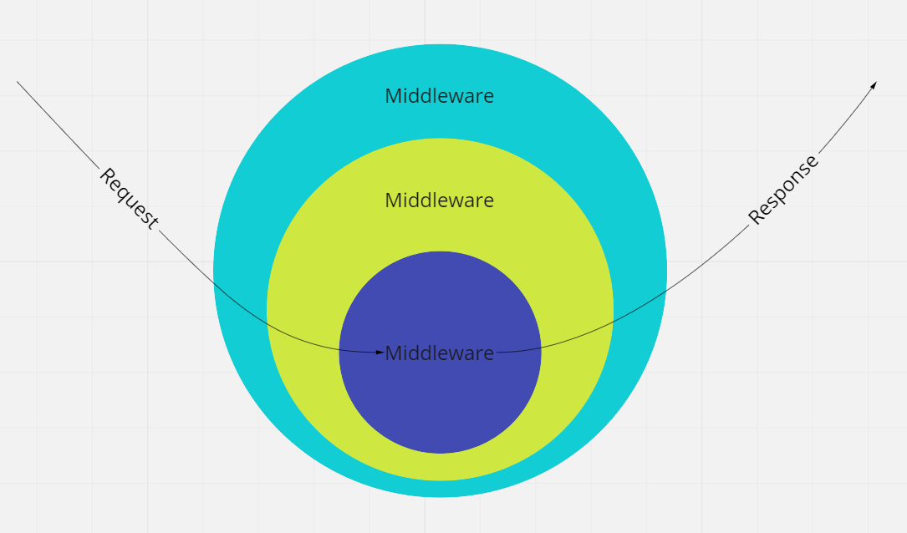

# Node.js服务端开发

前面课程中大家学习了如何通过Node.js开发命令行工具来操作文件和访问网络，这一节课来学习一些服务端开发的基本概念，并且尝试基于Node.js、MongoDB来开发高性能的服务端程序，本章内容都是以 HTTP/1.1 为例进行讲解，HTTP/2.0发生了很大的变化，但是对于本节课的学习没有影响。

## 基本概念

在开始之前需要先对服务端是什么有一个基本的概念，常见的网络软件架构有两类，分别是 B/S(browser/server)和C/S(client/server)，前者就是通过浏览器访问的网页应用，前端代码运行在浏览器中，通过HTTP协议和服务端进行通信；后者就是安装在设备中的客户端程序，如各种手机App，通常也是通过HTTP协议和服务端通信，我们要开发的就是这里面的服务端，它运行在远程服务器上，通过HTTP协议对外提供服务。

## 创建HTTP Server

使用Node.js创建HTTP Server非常简单，如下面的代码

```ts
import * as http from 'http'

const server = http.createServer((req, res) => {
  res.end('Hello world!')
})

server.listen(3000)
```

执行上面的代码，Node.js就会创建一个HTTP Server，并且监听 `3000` 端口，此时打开浏览器，访问 `http://localhost:3000/`，就可以看到输出的 `Hello world!` 了，代码中所引入的 `http` 模块是Node.js自带的标准库

### 工作原理

HTTP Server本质上就是对请求的报文进行解析、处理，然后将结果封装成响应报文并返回，所以对于一个HTTP服务端框架来说，最核心的工作有这么几项

- 参数解析，参数的传递有多种方式，如query、body、headers，需要将他们从原始的格式解析成方便操作的对象
- 路由分发，所谓路由就是将请求根据路径来匹配、分发给对应的代码来处理，这样才能支撑大规模的服务接口

示例代码 `server-demo` 就是一个非常简单的服务端工程，它基于HTTP模块进行封装，实现了简单的参数解析和路由分发，并且演示了JSON传输、文件上传下载、会话等功能的实现，看懂这些代码会对于理解服务端框架非常有帮助

### 会话原理

我们都知道HTTP请求是无状态的，请求之间并没有直接的上下文关联性，那用户登录这种功能又是怎么实现的？登录成功之后，后续的所有请求服务端就都知道是我当前的身份了，这里面就涉及到了cookie的运用，[https://developer.mozilla.org/en-US/docs/Web/HTTP/Cookies](https://developer.mozilla.org/en-US/docs/Web/HTTP/Cookies)

cookie可以伴随着HTTP的请求和响应来传递，如果服务端在响应头中指定了 `Set-Cookie`，那么浏览器就会执行这个指令，将其中指定的Cookie信息保存到本地，如下面的例子，假如用户在访问 `http://abc.com/api/user/login` 时，服务端返回了下面的头，xxxxxx是一个无规则的字符串，在服务器上和用户的身份信息存在对应关系

```plain
Set-Cookie: token=xxxxxx; path=/
```

浏览器接收到这个头之后，就会将这个cookie保存下来，因为指定了path=/，也就意味着当前域下所有的路径都会生效，当后面用户再访问该域的其他地址时，浏览器就会自动在请求头中机携带上这个Cookie，如

```plain
Cookie: token=xxxxxx
```

服务端通过请求头拿到传递过来的token值，获取到之前关联的用户信息，就完成身份验证了，所以Cookie就是你在互联网上的身份，很多账号被盗都是因为Cookie泄露。Cookie还有一些其他的属性，如过期时间，可以自行探索，理解Cookie对于理解会话原理至关重要

另外，如果一个Server需要更高效的开发和运行，通常还会提供一些能力如

- 配置服务
- 异常处理
- 参数检查
- 日志服务
- 中间件

这时候如果直接基于原始的HTTP来开发话就会有些吃力了，因为它提供的API比较底层，很多解析或者能力都需要自己实现，所以在实际的开发中我们都会基于一些框架来开发，这里我们介绍使用Koa.js

## Koa介绍

Koa.js是一个非常流行和轻量的服务端框架，它完全使用async/await，所以对于现代化的异步编程非常友好，它的核心是一个精简的洋葱模型中间件执行器，自身只做了非常基本的一些封装，复杂的能力实现都交给社区中间件来实现

### 洋葱模型



洋葱模型就是Koa中间件的处理流程，中间件的生命周期大致有

- 前期处理
- 交给并等待其他中间件处理
- 后期处理

多个中间件处理，就形成了上面的洋葱模型，每个请求进之后都会执行一遍上面的流程，最开始的中间件最先执行、最后退出，和洋葱一层一层的结构非常相似

### Application

使用Koa创建Server非常简单

```ts
import Koa from 'koa'

const app = new Koa()
app.use(async ctx => {
  ctx.body = 'Hello world!'
})

app.listen(3000)
```

其中 `app` 就是我们创建的Application应用给实例，`app.use()` 就可以挂载一个中间件，执行上面的代码，浏览器访问 `http://localhost:3000/` 就可以看到返回的 `Hello world!` 了

### Context上下文

类似与前面 `server-demo` 中的例子，每一个请求进来之后Koa都会创建一个保存了当前请求上下文信息的ctx对象，通过它我们可以拿到所有当前请求相关的信息如请求地址、请求参数、请求头、ip地址等等，详细可参考文档和示例代码

### 配置文件

在实际的项目中通常都会有很多的配置项，如数据库的连接信息、服务监听的端口，当程序运行在不同地方的时候这些信息可能会是有变化的，所以不应该将它们硬编码在代码中，我们通常会将这些信息放在配置文件当中，这样程序在启动的时候就可以动态获取这些数据了

实现配置文件的方式有很多种，这里介绍一个使用比较广泛、非常简单的方案，那就是 `dotenv` 这个库，首先在项目根目录放置一个 `.env` 文件，内容格式如下

```plain
PORT=4114
```

然后在入口代码的第一行引入

```ts
import 'dotenv/config'
```

`dotenv` 就会将配置文件中的内容解析成当前进程的环境变量，通过下面的方式就可以拿到这个值了

```ts
process.env.PORT
```

### body解析

对于请求对象来说，它其实是一个可读流，如 `server-demo` 中的例子，当有请求到达时就会触发 `createServer` 的回调，此时能拿到的只有请求头，body的数据还没有开始接收，然后body的数据类型可能有很多种，比如JSON、FormData、Binary，如果要正确解析它们需要这样来处理

- 收集请求流中的数据
- 根据请求头中的 `Content-Type` 判断收集到的数据的类型
- 根据类型选择对应的处理方式尝试解码

`koa-body` 就是专门来处理这个问题的中间件，常见的数据类型都能支持，也可以用来处理文件上传

### 路由处理

`koa-router` 是一个Koa的路由中间件，使用非常广泛，它的用法和前面自己封装的router非常类似，具体可以参考示例代码。

> 在编写服务端代码的时候一个非常常用设计模式就是代码分层，路由的作用应该仅用来定义API接口、处理参数、封装返回值，具体的业务逻辑需要交给service层，这样service层就是可以复用的，因为路由层很难复用，所以不应该在路由里面去做细节的业务逻辑处理

### API风格

HTTP接口有很多的风格，比如知名度比较高的restful，不过在实际的应用环境中接口通常都比较复杂，完全遵循restful有时不是很方便，在我们的例子中简化了这些概念

- 对于只读类型的请求都采用 `GET` 方式，参数通过query传递，如各种查询操作
- 对于会产生副作用的请求都采用 `POST JSON` 的方式，如登录、修改、删除

我们的服务端通常只会输出JSON或者二进制文件，对于JSON类型的返回,通常都会约定好一个固定的格式，这样方便客户端去处理，如我们在例子中统一都采用下面的返回格式

```ts
interface ApiResp {
  code: number
  message: string
  data: any
}
```

- `code` 表示业务执行的状态码，它和http响应状态码没有直接关系，这里当 `code` 为 `0` 时 我们约定为业务执行成功的状态
- `message` 表示错误信息，用户给调用者的提示，只有当 `code` 不为 `0` 时服务端才会返回 `message`
- `data` 表示返回的实际有效的数据，`code` 为 `0` 时才会携带 `data`，但是有的请求不需要返回数据，只需要知道执行的状态，此时只需要返回 `code` 就可以了，比如删除数据成功时

> 不同的项目通常都会有自己的接口约定，上面的规则也只是在我们 `demo` 中所采用的

### 异常处理

在执行某个请求的数据处理流程时，经常会遇到某个条件不满足需要提前终止返回错误状态的情况，比如用户想要下单某个id的商品，但是服务端第一步检查发现这个商品已经下架了，此时就需要直接返回错误，而无需继续往下执行了，此时可以封装一个自定义错误的类，需要提前终止的时候就直接new一个新的实例来抛出，然后在外面捕获抛出的错误来返回就可以了，这样整个代码的流程会很清晰

### 参数检查

服务端程序和前端在数据的处理上面有很大不同，服务端因为运行在远程服务器而不是用户自己的电脑上，所以对待用户输入的数据需要非常谨慎，应该假定用户输入的所有数据都是不可信的，需要经过合法性校验才允许使用，比如配型是否匹配，参数是否有缺失等等，否则很容易造成程序异常，`Joi` 是一个非常流行的用于js数据模型校验的库，我们可以用它在路由中检查请求的参数类型是否匹配，然后再交给service去处理

### 日志输出

服务端一旦上线通常就需要长时间稳定运行，所以就不像本地调试那么方便发现问题了，为了对服务的运行情况有一个大概的了解，通常都会设计日志输出的功能，将请求处理的关键信息记录下来，方便排查问题，在Koa中要实现请求日志的记录非常简单，我们可以设计一个logger中间件，让Koa第一个去加载它，根据洋葱模型的机制，它就可以覆盖整个请求的处理过程

### 接口调试

当我们写好了一批接口之后，接下来的问题就是该如何去测试和调试它们了，这里推荐使用 `Postman` 这个工具，它可以非常方便构造各种类型的HTTP请求，还可以对你的接口测试集合进行管理

另一个问题就是该如何使用VSCode对我们的TS/Node.js程序进行debug了，如果只靠日志打印来排查问题是非常困难的，这种时候就得依靠断点调试了。VSCode配置debug有很多种方式，这里介绍一种比较简单的方式

- 确保 `tsconfig.json` 中打开了 `sourcemap`
- 在工程根目录添加 `.vscode/launch.json`，内容格式如下

```json
{
  "version": "0.2.0",
  "configurations": [
    {
      "type": "node",
      "request": "launch",
      "name": "Launch Program",
      "skipFiles": [
        "<node_internals>/**"
      ],
      "program": "${workspaceFolder}/dist/index.js"
    }
  ]
}
```

- 在 `package.json` 的 `scripts` 中添加 `dev` 指令

```json
{
  "scripts": {
    "dev": "tsc -w"
  }
}
```

- 执行命令 `yarn dev`，就会启动TS的监控编译了，当有代码变化的时候会自动编译
- VSCode按 `F5` 就可以进入debug模式了，支持断点调试

> 如果直接使用VSCode创建默认的 `launch.json` 也是可以的，不过它会把TS的编译作为前置任务，也就是每次启动debug的时候需要先重新编译然后才会启动，这样等待的时间会有点长，体验不好。如果采用上面的方式，当我们修改了代码之后，`dev` 任务就在后台帮我们自动编译好代码了，此时再 `F5` 直接执行的是编译之后的js文件，无需等待，启动更快。至于其他方式debug配置，可以自行探索

## MongoDB

MongoDB是一种新型的文档数据库，和MySQL之类的关系型数据库有很大的不同，MongoDB采用的是类似JSON的存储格式，没有表结构的限制，使用方便、灵活性特别高，尤其适合Web应用的快速开发

### BSON

BSON是一种类似JSON的二进制存储格式，简称Binary JSON，它和JSON一样，支持内嵌的文档对象和数组对象，但是BSON有一些JSON没有的数据类型，如Date和二进制类型，如下面的结构

```js
{
  "_id" : ObjectId("626e39d5d71965cff6f4ec0a"),
  "account" : "13000000000",
  "nickname" : "Tom",
  "status" : 1,
  "activated" : true,
  "createdAt" : 1651390933788
}
```

### ObjectId

MongoDB中存储的文档中必须有一个 `_id` 键，这个键默认是个ObjectId对象，在每一个集合里面每一个文档都有唯一的 `_id` 值，来确保集合里面的每一个文档都能被唯一标识

### Node.js操作MongoDB

MongoDB原生的查询语言就是js风格的，所以如果要在Node.js中使用MongoDB也是非常简单的，通常会有两种选择

- 使用 `mongoose` 之类的知名ORM框架
- 使用原生的 `mongodb` 驱动进行操作

为了对MongoDB有一个更好的认识，这节课我们会先来学习原生 `mongodb` 驱动的使用，具体参考示例代码

# 课后任务

本次作业分为两个工程，分别实现多用户TODO的服务端和前端，这次的任务具备一定的开放性，需要自己思考一些设计的实现，详细说明如下

## 服务端

### 基本要求

- 创建 `task-13/todo-server` 作为服务端的工程目录
- 参考 `koa-demo` 搭建起服务端工程，使用 `mongodb` 原生驱动连接数据库
- 一定要记得添加 `.gitignore` 忽略掉不该提交的目录
- 实现多用户系统，支持用户注册、登录、修改密码，如果用户被禁用则不允许登录
- 实现基于cookie的session会话系统，支持退出登录
- 登录用户可以创建TODO，数据记录在mongodb数据库
- 检查接口参数合法性，数据处理的时候需要保证一致性
- 代码分层要清晰

### 数据结构参考

创建数据模型时，可以参考下面的数据结构

```ts
// 用户状态
enum UserStatus {
  // 正常
  Normal = 1,
  // 被禁用
  Disabled = 2
}
```

```ts
// 用户
interface IUser {
  // 账号
  account: string
  // 昵称
  nickname: string
  // 加密之后的密码
  password: string
  // 密码加密的盐
  salt: string
  // 用户状态
  status: UserStatus
  // 创建时间
  createdAt: number
}
```

```ts
// 会话
interface ISession {
  // session id
  sid: string
  // 关联的用户_id
  userId: ObectId
  // 登录的ip地址
  ip: string
  // 创建时间
  createdAt: Date
}
```

```ts
// 任务
interface ITask {
  // 内容
  content: string
  // 是否完成
  finished: boolean
  // 是否重要
  important: boolean
  // 用户的_id
  userId: ObjectId
  // 创建时间
  createdAt: number
}
```

### 关键接口实现

> 用户注册

用户通过账号、昵称、密码可以注册一个账号，注册时服务端应该要检查账号、昵称是否存在同名，最好给mongodb创建唯一索引。密码应该加密存储，加密过程可以采用 `sha1(password + salt)` 的形式，salt是服务端随机生成的一段字符串，用于增强密码的安全性

> 用户登录

用户通过账号、密码可以登录系统，服务端需要设计好登录认证的过程，如果账号存在，用数据库中的salt和传入的密码做加密，和数据库中的密文作比较，一致的话才能认为密码输入正确；密码验证通过之后需要生成一个随机的session_id，和登录的用户相关联，保存在数据库中，会话通常都会设定一个有效期，比如2周失效，可以借助于mongodb的ttl索引自动清除，最后服务端需要将session_id通过set-cookie返回给客户端

> 获取用户信息

获取当前登录用户的用户对象，服务端应该从cookie中取出session_id，通过数据库中保存的会话记录找到关联的用户_id，再去查找对应的用户信息，需要注意，用户的敏感信息如password、salt是不应该返回的，需要过滤掉，可以在查询的借助于 projection 特性来实现

> 修改密码

需要先验证旧密码是否正确，和登录类似，然后再用新密码生成一对salt和加密之后的密文，更新数据库中的这两个值，通常还需要清除已存在的session

> 退出登录

删除当前session_id对应的session记录，删除session_id的cookie

> 任务列表

返回当前登录用户的任务列表，需要支持分页，需要支持根据不同的条件来过滤，如是否完成、是否重要

> 添加任务

将用户提交的任务内容保存到数据库

> 更新任务

根据传入的_id来修改指定的任务是否完成、是否重要，需要检查权限

> 删除任务

根据传入的_id来删除任务记录，需要检查权限

### 中间件

服务端需要实现一个登录检查的中间件，因为除了用户注册、登录之外，其他的接口均需要登录才允许访问，可以通过一个中间件在路由之前先完成登录状态的检查，如果没有登录而要访问的接口路径又不在白名单之内，就拒绝访问，如果已登录，可以将用户信息对象存放在 `ctx.state` 中，如

```ts
ctx.state.user = userinfo
```

这样在路由中就可以直接拿到当前登录的用户对象了，无需再重复查询

```ts
console.log(ctx.state.user)
```

## 前端

### 基本要求

- 创建 `task-13/todo-front` 作为前端端的工程目录，使用 `cra` 脚手架
- 引入 `antd-mobile`，尽可能使用其中的组件，替换之前自定义的组件，掌握这个组件库的使用
- 在原有 `todo-hooks` 功能的基础上，需要增加独立的用户注册、登录、修改密码的功能页面
- 用户未登录状态下直接访问主页面时需要自动跳转到登录页

### 路由页面参考

> 登录页

只允许未登录状态访问，如果已登录自动跳回主页面

> 注册页

只允许未登录状态访问，如果已登录自动跳回主页面

> 主页面

就是原来的任务列表主页面，这里可以将抽屉菜单放在该页面，抽屉中需要展示登录用户的昵称、修改密码、退出登录的入口，然后将几个子页面面作为它的子路由来定义，包括

- 任务列表页
- 已完成列表页
- 重要任务列表页
- 修改密码表单页面

### 功能实现

> 登录检查

可以借助于axios的响应拦截器，识别服务端定义的未登录状态的code状态码，如果未登录并且处于主页面，自动跳转到登录页，如果已登录并且处于登录页或者注册页，自动跳回主页面

> 状态管理

和之前本地存储的方式不同，任务列表数据不再需要保存在全局状态中，参考music-front中自定义hook的请求方式，但是需要将登录用户的信息放到全局状态中，应用一挂载就应该去请求一下服务端获取登录用户的接口，将拿到的用户信息更新到context状态中，注销登录时需要记得清除
