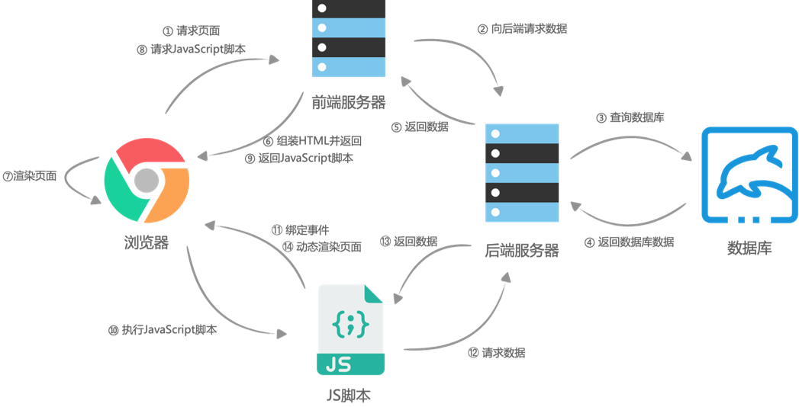
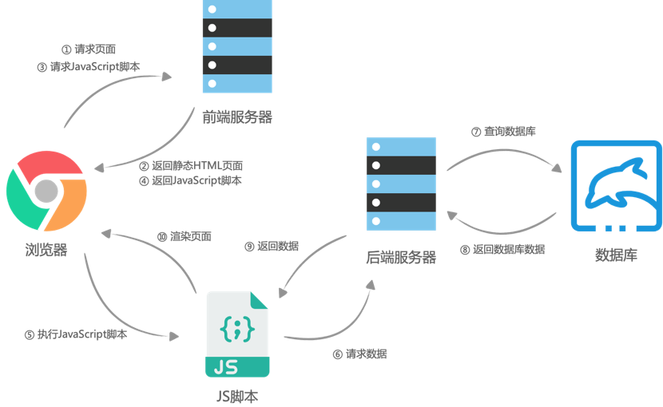
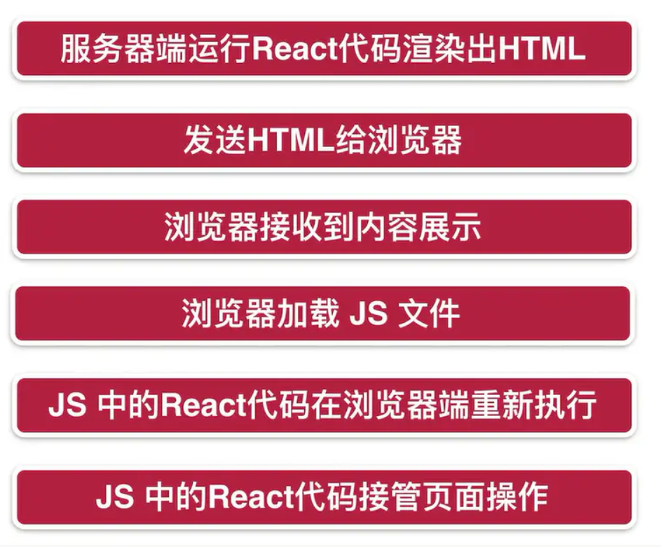

# React服务端渲染

## 前后端分离

早期的Web都是采用服务端渲染的模式，通过PHP、JSP之类的技术在服务端将需要渲染的HTML拼接好直接返回，那个时代的网页交互都非常简单，主要是以内容展示型的页面为主。随着浏览器、Web技术的飞速发展，前端交互变得越来越复杂，前后端分离的开发模式变成了主流，React、Vue之类的框架也让前端的开发效率得到了极大提升。



前后端分离让前端开发真正具备生产力和构建大型应用的能力，越来越多的工具采用Web技术来构建，如VS Code。但是前后端分离也带来一些问题，浏览器需要加载完JS脚本之后才能去请求服务端数据来渲染页面，会有明显的加载时间等待，而且也很难支持搜索引擎SEO，对于内容型的网站不是理想方案。



## 同构模式

对于偏内容型的网站，比如新闻、博客，现在又回到了服务端渲染的需求，但是传统的服务端渲染模式很难充分利用现代前端开发的工具链，比如webpack、React、CSS Modules，如果我们想要为服务端渲染的页面添加事件绑定或者一些动态操作，就会变得比较困难，可能需要采用DOM操作的方式。

React提供了服务端渲染的能力，它可以在Node端将React组件树渲染为DOM字符串，拼接好HTML直接返回，这样用户在打开页面的时候就可以直接看到内容，而无需等待脚本加载完，甚至没有脚本也可能看到完整的内容。为了能在浏览器端继续使用React的能力，服务端在返回拼接好的HTML字符串时，将渲染组件所用到的数据也同时返回，这一步叫做 `脱水`，浏览器在加载完JS脚本之后，通过返回的数据再对组件树进行一次渲染，和服务端返回的DOM树做比对，完成状态、事件的绑定，接管页面的操作，这一步叫做 `注水(hydrate)`。所以，有些代码会在Node端、浏览器端分别执行一次，这就是同构开发模式，同构只有在首次进入页面的时候是在服务端渲染的，后续还是在浏览器端受React控制。



同构模式有几个关键问题需要解决，`music-ssr` 工程基于 `Koa` 框架完整演示了同构模式的工作流程。

### 数据的获取

前后端分离的时候我们是等待脚本加载完，然后向服务端请求数据完成组件的渲染，现在我们需要把这个过程放到服务端来进行，也就是说用户在向Node请求页面的时候，Node需要先向后端服务请求所需要的数据，然后用这些数据去渲染页面组件，得到HTML字符串。

### 路由匹配

前后端分离的项目路由匹配是交给浏览器控制的，服务端渲染的模式，路由需要由服务端来控制

### 资源文件处理

Webpack可以帮我们处理很多类型的资源，比如图片、CSS，并且可以生成hash码来标记版本、清除缓存，这些资源我们通常都是采用import的方式在组件中引用的，然后交给Webpack处理，问题是如果在服务端进行组件的渲染，Node是无法直接处理这些导入的，这就需要使用Webpack来对服务端代码也进行预编译，这样Node在执行的时候，就已经是编译过的可正常执行的代码了，图片路径、CSS Modules之类的引用，都已经处理好。

### 代码共用

前面有提到同构模式下很多代码会在Node、浏览器端分别执行，这就涉及到了代码共用的问题，因为两个端的执行环境不同，API也不一样，如果代码编写不当，就会出现在某一个端无法执行。

### API代理

由于用户访问的页面是由Node提供服务的，对于前端的异步API请求需要进行代理，将其转发到真实的后端服务器。

## Next.js

要完整实现一套同构开发框架有非常多的工作要做，好在Next.js帮我们搭建好了一切，上手非常简单，通过它我们很容易实现同构开发的模式，而且使用上和前后端分离的模式没有太大的差异，Next.js会自动按页面对代码进行拆分，对于需要服务端渲染的项目可以明显提升开发效率和加载体验。Next.js还支持静态导出，比如可以将我们的博客文章导出为HTML访问，而无需JS脚本的支持。`music-nextjs` 采用Next.js重新实现了之前的音乐列表项目，可以作为学习参考，下面介绍几个Next.js中的核心概念。

### 创建工程

```
yarn create next-app my-next-app --typescript
```

该命令会创建一个使用TypeScript的名为 `my-next-app` 的工程

### 路由

Next.js无需配置路由，默认是采用文件系统映射的路由模式，比如访问 `/about` 对应的就是 `pages/about.tsx`，路由还支持参数模式，如果定义了 `pages/detail/[id].tsx` 组件，则访问 `/detail/123` 之类的地址就会交给该组件，`id` 传递的参数就是 `123`。`pages` 目录模式是放在最外层的，我们可以把它移动到 `src` 目录，方便代码管理。

### 获取数据

页面可以导出一个 `getServerSideProps` 异步函数，Next.js在服务端渲染该组件时会先调用该函数，我们需要在这个函数里面获取页面中需要渲染的数据，该函数返回的数据决定了Next.js下一步如何渲染该页面，如果返回了 `props`，则会被传递给页面组件进行渲染，如果返回了 `redirect`，则会直接重定向，可用于检查登录状态之类的场景。

### 图片

Next.js提供了一个封装的图片组件 `next/image`，自带一些高级特性如懒加载等，并且默认ESLint规则要求使用该组件替代 `img`，但是该组件使用上面有一些不便，如果希望使用原生 `img`，可以修改 `.eslintrc`，添加内容

```json
"rules": {
  "@next/next/no-img-element": "off"
}
```

### CSS

Next.js默认支持CSS、SASS以及CSS Modules，所有以 `.module.css`、`.module.scss` 结尾的导入都会开启CSS Modules转换，如果需要使用SASS，需要 `yarn add sass --dev`

### 代理

为了支持代理，我们需要自定编写一个Node.js脚本来创建调试服务，参考 `music-nextjs/server.js`

### 代码复用

组件、API的请求代码都是共用的，既可以在服务端执行，也可以在浏览器端执行。

### 身份认证

如果Next向服务端请求数据的时候需要验证登录身份，那么需要手动传递cookie，比如在 `getServerSideProps` 中，通过 `ctx.req.cookies.token` 拿到 `token`，然后在axios请求的时候将token放到请求头的 `cookie` 中，需要注意的是在浏览器端不需要执行这一步操作，因为浏览器会自动携带cookie。

## Next.js使用定位

既然Next.js自身就是服务端渲染，大家可能就会有这样的疑问，我直接用Next.js操作数据库不就可以了吗，为什么还需要另外再写一个服务端提供API？答案是：可以，但不推荐。通常来说数据库只应该由一个主程序来操作，其他应用通过该程序提供的API来访问，这样可以保证数据逻辑的一致性。考虑一个这样的场景，对于同一个数据库中的数据结构，如果有多个程序都直接对数据库进行操作，但是每个程序的操作逻辑不同，会出现什么问题？

在实际项目中，服务端逻辑通常都很复杂，而且都是面向多端服务的，不会像我们练习的项目这么简单，比如我们想要做一个管理平台的时候，就可以和前端共用一套服务端API，手机App也可以接入，如果用Next.js直接查询数据库，就不合适。

所以，通常我们把Next.js这类同构框架定位成服务端渲染的中间层，用来衔接后端服务和前端界面，它的作用就是在服务端提前获取数据渲染界面，而不是用来处理其他任务。

至于是采用服务端渲染还是前后端分离，要看具体的产品特点和定位，对于偏工具和管理性的、交互比较复杂的项目，建议采用前后端分离；对于偏内容展示性、交互相对简单，尤其是需要支持SEO的项目，建议使用Next.js，有一些项目也可以采用混合开发，即部分服务端渲染，部分前端渲染。

# 课后任务

本次的任务和上次的类似，也是分为前后端两个工程，用来实现一个简单的笔记应用，用来演示具体交互的示例工程

## 服务端

### 基本要求

- 创建 `task-14/note-server` 作为服务端的工程目录
- 服务端架构和前面的任务保持一致，基于Koa + MongoDB
- 实现多用户系统，可以直接复用上一次的代码
- 其他要求参考上期作业
- 创建 `task-14/note-server/README.md`，将服务端设计的数据结构、API接口列表以及设计思路记录其中

### 核心功能

> 用户

支持注册、登录、退出登录

> 文件夹

类似于文件系统的目录结构，笔记需要存储在某一个目录下

> 笔记

笔记用来记录具体内容，实现增删改查，笔记内容采用富文本模式，也就是保存HTML片段

> 分享

可以将一篇笔记生成分享链接，外部用户无需登录即可访问，并且记录分享被查看的次数，每个文件只允许生成一个链接，如果取消之后再生成，分享链接会变化，设计上面需要考虑可扩展性，比如过期时间、访问密码等需求的支持

### 关键点

- 文件夹是一个递归的层级关系
- 对文件的删除等操作，需要考虑数据一致性的问题
- 分享链接需要具备不可预测性
- 分享、文件夹的数据结构设计，有的地方需要用到聚合查询了
- 考虑服务端xss的过滤问题（本次不强制要求）

## 前端

### 基本要求

- 创建 `task-14/note-front` 作为服务端的工程目录，使用Next.js + TypeScript开发
- 参考 `next-note` 的交互逻辑
- 使用 `antd-mobile` 组件库，配置ssr渲染
- 文档列表需要支持下拉刷新和触底加载

### 核心功能

> 注册、登录

示例工程中没有添加，需要自己实现

> 最近

展示用户最近编辑的文档列表

> 文件夹

展示文件夹目录层级列表

> 分享列表

展示自己分享的文件列表

> 分享查看

查看分享的文档，此处需要展示文章的html内容，不需要编辑器

> 我

修改密码、退出登录

> 文档操作

新建文件夹、新建文件、删除、重命名、编辑、分享，新建操作就是在当前目录下创建目标，如果是在“最近”列表，则默认创建在根目录

### 关键点

- 文档编辑采用了富文本编辑器 `react-quill`，但是在next.js中需要采用动态加载的方式，因为它不能直接在服务端渲染，参考 [https://www.simplenextjs.com/posts/next-rich-editor-quill](https://www.simplenextjs.com/posts/next-rich-editor-quill)，示例直接用的默认配置项，可以看情况自己添加需要的能力

- 示例用到了动态路由参数 [https://nextjs.org/docs/routing/dynamic-routes](https://nextjs.org/docs/routing/dynamic-routes)

- 目录切换的展示

- Next.js数据获取、身份验证

- dayjs插件的使用，如时间比较
